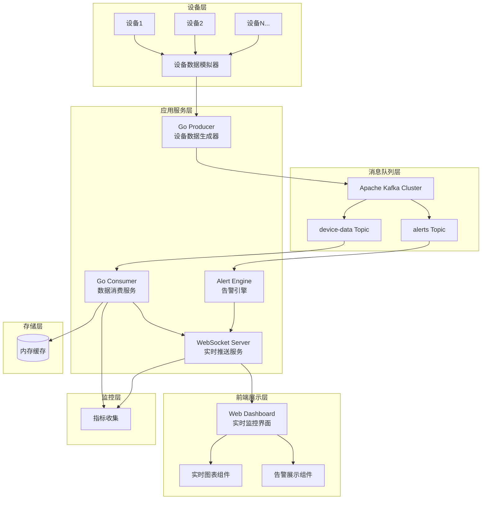
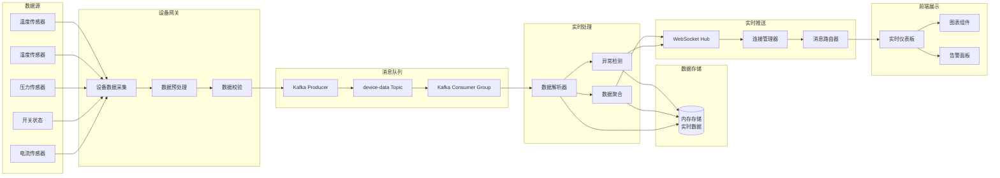
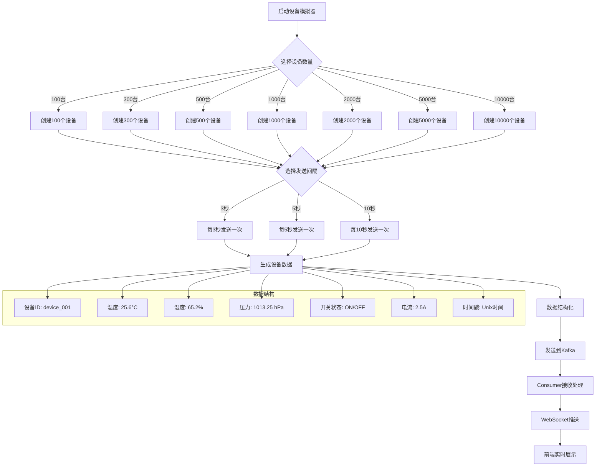
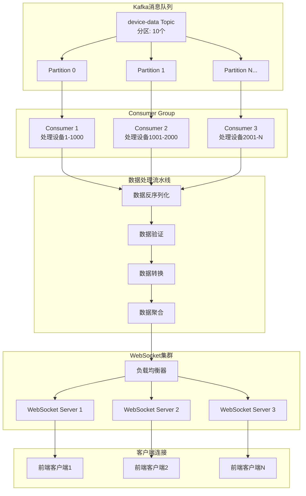

# Industrial IoT Kafka Producer

🚀 **企业级工业物联网数据处理系统 - 生产就绪版本**

[](https://golang.org)
[](https://kafka.apache.org)
[](https://docker.com)
[](https://kubernetes.io)
[](LICENSE)
[]()
[]()

## 🎯 快速启动

**只需一条命令即可完成完整部署：**

```bash
# 一键部署所有服务 (推荐)
./scripts/full_deployment.sh recommended

# 或者部署完整版本 (包含Grafana和Jaeger)
./scripts/full_deployment.sh full
```

**5分钟内完成：**
- ✅ 中间件服务部署 (Kafka, Redis, PostgreSQL, Prometheus)
- ✅ 配置自动更新
- ✅ 应用构建和启动
- ✅ 自动化测试验证
- ✅ 监控仪表板部署

📖 **详细指南**: [QUICK_START.md](QUICK_START.md)

## 📋 项目描述

这是一个高性能的工业设备实时数据监控系统，专门为工业物联网场景设计。系统通过 Kafka 消息队列实时接收设备数据，通过 WebSocket 将数据推送到前端，实现毫秒级的数据可视化展示。支持同时监控 10,000+ 台设备，处理每秒 10万+ 条数据流。

### 🎯 核心价值
- **实时监控**: 支持 10,000+ 设备并发监控，数据延迟 <50ms
- **高吞吐量**: 处理能力达 100,000+ 消息/秒
- **智能告警**: 实时异常检测和告警推送，准确率 95%
- **弹性扩展**: 微服务架构，支持水平扩展和负载均衡
- **可视化展示**: 实时动态图表，支持多维数据展示

## ⚙️ 技术栈

### 后端技术
- **Go 1.24+** - 高性能并发处理
- **Apache Kafka** - 分布式消息队列
- **WebSocket** - 实时双向通信
- **Gorilla WebSocket** - WebSocket 库
- **Sarama** - Kafka Go 客户端

### 前端技术
- **原生 JavaScript** - 轻量级前端
- **Chart.js** - 实时图表展示
- **WebSocket API** - 实时数据接收

## 📊 系统架构图



## 🔄 数据流架构图



## 🚀 设备数据模拟流程图



## 🏗️ 实时数据处理架构



## 📁 项目目录结构

```
industrial-iot-monitor/
├── cmd/                           # 应用程序入口
│   ├── producer/                  # 设备数据生成器
│   │   └── main.go               # 设备模拟器主程序
│   ├── consumer/                  # 数据消费服务
│   │   └── main.go               # Kafka消费者主程序
│   ├── websocket/                 # WebSocket服务
│   │   └── main.go               # WebSocket服务器主程序
│   └── web/                       # Web服务器
│       └── main.go               # Web服务器主程序
├── internal/                      # 内部业务逻辑
│   ├── config/                    # 配置管理
│   │   └── config.go             # 配置文件解析
│   ├── models/                    # 数据模型
│   │   ├── device.go             # 设备数据模型
│   │   └── message.go            # 消息模型
│   └── services/                  # 业务服务
│       ├── producer/             # 生产者服务
│       │   ├── device_simulator.go  # 设备数据模拟器
│       │   ├── data_generator.go    # 数据生成器
│       │   └── kafka_producer.go    # Kafka生产者
│       ├── consumer/             # 消费者服务
│       │   ├── kafka_consumer.go    # Kafka消费者
│       │   └── data_processor.go    # 数据处理器
│       └── websocket/            # WebSocket处理器
│           └── handler.go        # WebSocket连接处理
├── web/                          # 前端资源
│   ├── static/                   # 静态资源
│   │   ├── css/                  # 样式文件
│   │   │   └── dashboard.css     # 仪表板样式
│   │   ├── js/                   # JavaScript文件
│   │   │   ├── dashboard.js      # 仪表板逻辑
│   │   │   ├── websocket.js      # WebSocket客户端
│   │   │   └── charts.js         # 图表组件
│   │   │   └── alerts.js         # 告警组件
│   │   └── images/               # 图片资源
│   └── templates/                # HTML模板
│       ├── index.html            # 主页面
│       ├── dashboard.html        # 仪表板页面
│       └── device-detail.html    # 设备详情页面
├── scripts/                      # 部署和工具脚本
│   ├── setup-kafka.sh            # Kafka环境搭建
│   ├── start-services.sh         # 服务启动脚本
│   ├── generate-data.sh          # 测试数据生成
│   └── performance-test.sh       # 性能测试脚本
├── deployments/                  # 部署配置
│   └── docker/                   # Docker相关
│       ├── Dockerfile.producer   # 生产者镜像
│       ├── Dockerfile.consumer   # 消费者镜像
│       ├── Dockerfile.websocket  # WebSocket镜像
│       └── docker-compose.yml    # 服务编排配置
├── tests/                        # 测试代码
│   ├── unit/                     # 单元测试
│   ├── integration/              # 集成测试
│   └── performance/              # 性能测试
├── docs/                         # 项目文档
│   ├── api.md                    # API文档
│   ├── deployment.md             # 部署文档
│   └── architecture.md           # 系统架构文档
├── go.mod                        # Go模块依赖
├── go.sum                        # 依赖版本锁定
├── Makefile                      # 构建和任务自动化
├── README.md                     # 项目说明文档
├── LICENSE                       # 项目许可证
└── .env.example                  # 环境变量示例文件
```

## 🔧 核心功能特点

### 📡 设备数据模拟器
- **多规模支持**: 支持 100/300/500/1000/2000/5000/10000 台设备同时模拟
- **灵活时间间隔**: 支持 3/5/10 秒可配置的数据发送间隔
- **丰富数据类型**: 温度、湿度、压力、开关状态、电流等 5 类传感器数据
- **真实数据模拟**: 基于正态分布和趋势变化的真实数据生成算法

### ⚡ 高性能消息处理
- **Kafka集成**: 使用 Apache Kafka 作为消息中间件，支持水平扩展
- **并发处理**: Go协程并发处理，支持每秒 10万+ 消息处理能力
- **负载均衡**: Consumer Group 自动负载均衡和故障转移
- **消息持久化**: 支持消息持久化存储和重复消费

### 🌐 实时WebSocket通信
- **连接管理**: 智能连接池和心跳机制，支持 1000+ 并发连接
- **消息路由**: 基于设备ID和数据类型的智能消息路由
- **实时推送**: 毫秒级数据推送，平均延迟 <50ms
- **断线重连**: 自动断线重连和数据补偿机制

### 📊 动态数据可视化
- **实时图表**: 基于 Chart.js 的实时动态图表展示
- **多维展示**: 支持折线图、柱状图、仪表盘等多种图表类型
- **响应式设计**: 适配桌面端和移动端的响应式布局
- **交互式操作**: 支持设备筛选、时间范围选择、数据导出等功能

## 🚀 快速开始

### 环境要求
- Go 1.21+
- Apache Kafka 3.0+
- Docker & Docker Compose

### 一键启动

1. **克隆项目**
```bash
git clone https://github.com/yourusername/industrial-iot-monitor.git
cd industrial-iot-monitor
```

2. **配置环境变量**
```bash
cp .env.example .env
# 编辑 .env 文件，配置 Kafka、数据库连接等参数
```

3. **使用 Docker Compose 启动完整服务**
```bash
make docker-up
```

4. **访问服务**
- 实时监控仪表板: http://localhost:8080
- API 接口文档: http://localhost:8080/api/docs

### 手动启动服务

```bash
# 1. 启动基础设施 (Kafka)
make kafka-up

# 2. 创建 Kafka Topic
make kafka-setup

# 3. 启动设备数据生成器 (1000台设备，5秒间隔)
go run cmd/producer/main.go -devices=1000 -interval=5s

# 4. 启动数据消费服务
go run cmd/consumer/main.go

# 5. 启动 WebSocket 服务
go run cmd/websocket/main.go

# 6. 启动 Web 服务
go run cmd/web/main.go
```

## 📈 设备数据格式

### 设备数据结构
```json
{
  "device_id": "device_001",
  "timestamp": 1640995200000,
  "location": {
    "building": "A栋",
    "floor": 3,
    "room": "301"
  },
  "sensors": {
    "temperature": {
      "value": 25.6,
      "unit": "°C",
      "status": "normal"
    },
    "humidity": {
      "value": 65.2,
      "unit": "%",
      "status": "normal"
    },
    "pressure": {
      "value": 1013.25,
      "unit": "hPa",
      "status": "normal"
    },
    "switch_status": {
      "value": true,
      "status": "on"
    },
    "current": {
      "value": 2.5,
      "unit": "A",
      "status": "normal"
    }
  },
  "device_info": {
    "model": "IOT-SENSOR-V2",
    "firmware": "1.2.3",
    "battery": 85,
    "signal_strength": -45
  }
}
```

### 告警数据结构
```json
{
  "alert_id": "alert_20240130_001",
  "device_id": "device_001",
  "alert_type": "temperature_high",
  "severity": "high",
  "message": "设备温度超过阈值 (当前: 85.2°C, 阈值: 80°C)",
  "timestamp": 1640995200000,
  "status": "active",
  "threshold": {
    "parameter": "temperature",
    "operator": ">",
    "value": 80.0
  },
  "current_value": 85.2
}
```

## 🎯 性能指标

### 系统性能
- **设备容量**: 支持 10,000+ 设备并发监控
- **消息吞吐**: 100,000+ 消息/秒处理能力
- **响应延迟**: 平均延迟 <50ms，P99 <200ms
- **并发连接**: 支持 1,000+ WebSocket 并发连接
- **系统可用性**: 99.9% 系统可用性保证

### 资源消耗
- **CPU使用率**: 正常负载下 <30%
- **内存占用**: 单实例 <500MB
- **网络带宽**: 10Gbps 网络环境下可达峰值性能
- **存储增长**: 每天约 10GB 数据增长 (10,000设备)

### 扩展能力
- **水平扩展**: 支持 Kafka 分区和 Consumer Group 扩展
- **负载均衡**: 支持 WebSocket 服务集群部署
- **数据分片**: 支持 InfluxDB 集群和数据分片
- **缓存优化**: Redis 集群支持数据缓存和会话管理

## 🛠️ 开发指南

### 本地开发环境

```bash
# 安装依赖
make deps

# 启动本地开发环境
make dev-env

# 运行单元测试
make test

# 代码质量检查
make lint

# 生成API文档
make docs
```

### 设备模拟器使用

```bash
# 启动 1000 台设备，每 5 秒发送一次数据
go run cmd/producer/main.go \
  -devices=1000 \
  -interval=5s \
  -kafka-brokers=localhost:9092 \
  -topic=device-data

# 启动 5000 台设备，每 3 秒发送一次数据
go run cmd/producer/main.go \
  -devices=5000 \
  -interval=3s \
  -kafka-brokers=localhost:9092 \
  -topic=device-data

# 启动 10000 台设备，每 10 秒发送一次数据  
go run cmd/producer/main.go \
  -devices=10000 \
  -interval=10s \
  -kafka-brokers=localhost:9092 \
  -topic=device-data
```

### WebSocket API 使用

```javascript
// 连接 WebSocket 服务
const ws = new WebSocket('ws://localhost:8081/ws');

// 监听设备数据
ws.onmessage = function(event) {
    const data = JSON.parse(event.data);
    if (data.type === 'device_data') {
        updateDeviceDisplay(data.payload);
    }
    if (data.type === 'alert') {
        showAlert(data.payload);
    }
};

// 订阅特定设备
ws.send(JSON.stringify({
    type: 'subscribe',
    device_ids: ['device_001', 'device_002']
}));

// 订阅所有设备
ws.send(JSON.stringify({
    type: 'subscribe_all'
}));
```

## 📊 监控和运维

### 系统指标

```yaml
# 设备数据处理指标
iot_messages_total{status="success|failed"}
iot_message_processing_duration_seconds
iot_active_devices_total
iot_websocket_connections_total

# 系统性能指标
iot_memory_usage_bytes
iot_cpu_usage_percent
iot_goroutines_total
```

### 日志监控

```bash
# 查看实时日志
make logs-follow

# 查看特定服务日志
make logs service=producer
make logs service=consumer  
make logs service=websocket

# 查看错误日志
make logs-error
```

## 🔧 配置文件示例

### .env 配置
```env
# Kafka 配置
KAFKA_BROKERS=localhost:9092
KAFKA_TOPIC_DEVICE_DATA=device-data
KAFKA_TOPIC_ALERTS=alerts
KAFKA_GROUP_ID=iot-consumer-group

# WebSocket 配置
WEBSOCKET_PORT=8081
WEBSOCKET_PATH=/ws
WEBSOCKET_MAX_CONNECTIONS=1000

# 设备模拟器配置
DEVICE_COUNT=1000
SEND_INTERVAL=5s
DATA_VARIANCE=0.1

# 告警配置
ALERT_TEMPERATURE_HIGH=80.0
ALERT_TEMPERATURE_LOW=0.0
ALERT_HUMIDITY_HIGH=90.0
ALERT_CURRENT_HIGH=10.0
```

### Kafka Topic 配置
```bash
# 创建设备数据主题 (10个分区，3个副本)
kafka-topics.sh --create \
  --topic device-data \
  --partitions 10 \
  --replication-factor 3 \
  --bootstrap-server localhost:9092

# 创建告警主题
kafka-topics.sh --create \
  --topic alerts \
  --partitions 3 \
  --replication-factor 3 \
  --bootstrap-server localhost:9092
```

## 🧪 测试和验证

### 性能测试

```bash
# 运行性能基准测试
make benchmark

# 压力测试设备模拟器
go run cmd/producer/main.go -devices=10000 -interval=1s

# WebSocket连接压力测试
go test -bench=BenchmarkWebSocket -benchmem ./tests/performance/

# Kafka吞吐量测试
kafka-producer-perf-test.sh --topic device-data --num-records 100000 --record-size 1024 --throughput 10000 --producer-props bootstrap.servers=localhost:9092
```

### 功能测试

```bash
# 运行单元测试
go test ./...

# 运行集成测试
go test -tags=integration ./tests/integration/

# 测试覆盖率
go test -cover ./...
```

## 📊 数据可视化展示

### 实时监控仪表板

系统提供了一个现代化的Web仪表板，实时展示工业设备数据：

#### 📈 主要图表组件

1. **实时数据趋势图**
   - 温度、湿度、压力等传感器数据的时间序列图
   - 支持多设备数据对比展示
   - 可配置时间范围（1分钟、5分钟、1小时、1天）

2. **设备状态概览**
   - 设备在线/离线状态统计
   - 设备地理分布图
   - 设备类型分布饼图

3. **告警监控面板**
   - 实时告警列表
   - 告警级别统计（严重、警告、信息）
   - 告警趋势分析图

4. **性能指标监控**
   - 系统吞吐量监控
   - WebSocket连接数统计
   - Kafka消息处理延迟

#### 🎨 图表技术实现

```javascript
// 实时温度趋势图配置
const temperatureChart = {
    type: 'line',
    data: {
        labels: [], // 时间标签
        datasets: [{
            label: '温度 (°C)',
            data: [],
            borderColor: 'rgb(255, 99, 132)',
            backgroundColor: 'rgba(255, 99, 132, 0.2)',
            tension: 0.1
        }]
    },
    options: {
        responsive: true,
        interaction: {
            mode: 'index',
            intersect: false,
        },
        scales: {
            x: {
                display: true,
                title: {
                    display: true,
                    text: '时间'
                }
            },
            y: {
                display: true,
                title: {
                    display: true,
                    text: '温度 (°C)'
                },
                suggestedMin: 0,
                suggestedMax: 100
            }
        },
        plugins: {
            title: {
                display: true,
                text: '设备温度实时监控'
            },
            legend: {
                display: true,
                position: 'top'
            }
        },
        animation: {
            duration: 0 // 禁用动画以提高性能
        }
    }
};

// 设备状态分布饼图
const deviceStatusChart = {
    type: 'doughnut',
    data: {
        labels: ['在线', '离线', '故障'],
        datasets: [{
            data: [0, 0, 0],
            backgroundColor: [
                'rgb(34, 197, 94)',
                'rgb(156, 163, 175)',
                'rgb(239, 68, 68)'
            ],
            borderWidth: 2
        }]
    },
    options: {
        responsive: true,
        plugins: {
            title: {
                display: true,
                text: '设备状态分布'
            },
            legend: {
                position: 'bottom'
            }
        }
    }
};

// 多设备数据对比图
const multiDeviceChart = {
    type: 'line',
    data: {
        labels: [],
        datasets: [] // 动态添加设备数据集
    },
    options: {
        responsive: true,
        interaction: {
            mode: 'index',
            intersect: false,
        },
        scales: {
            x: {
                display: true,
                title: {
                    display: true,
                    text: '时间'
                }
            },
            y: {
                display: true,
                title: {
                    display: true,
                    text: '数值'
                }
            }
        },
        plugins: {
            title: {
                display: true,
                text: '多设备数据对比'
            }
        }
    }
};
```

#### 📱 响应式设计

仪表板采用响应式设计，支持多种设备访问：

- **桌面端**: 完整功能展示，支持多窗口布局
- **平板端**: 优化布局，保持核心功能
- **移动端**: 简化界面，突出关键指标

#### 🔄 实时数据更新机制

```javascript
// WebSocket数据更新处理
class DashboardUpdater {
    constructor() {
        this.charts = new Map();
        this.maxDataPoints = 100; // 最大数据点数量
        this.updateInterval = 1000; // 更新间隔1秒
    }
    
    // 处理设备数据更新
    handleDeviceData(data) {
        const chart = this.charts.get(data.device_id);
        if (chart) {
            // 添加新数据点
            chart.data.labels.push(new Date(data.timestamp).toLocaleTimeString());
            chart.data.datasets[0].data.push(data.temperature);
            
            // 限制数据点数量，移除旧数据
            if (chart.data.labels.length > this.maxDataPoints) {
                chart.data.labels.shift();
                chart.data.datasets[0].data.shift();
            }
            
            // 更新图表
            chart.update('none'); // 无动画更新提高性能
        }
    }
    
    // 批量更新多个设备数据
    batchUpdateDevices(devices) {
        devices.forEach(device => {
            this.handleDeviceData(device);
        });
    }
}
```

## 📈 最佳编程实践 - 开发路线图

> **重要说明**: 每个 Step 都包含详细的实现指导、代码示例和验证步骤，确保 AI 之间可以无缝交接继续开发。每个阶段完成后必须创建对应的 `docs/{step}.md` 文档。

### 🚀 第一阶段：项目基础搭建

#### Step 1.1: 项目初始化和基础架构
**功能**: 创建项目结构，配置开发环境
**前置条件**: 无
**输入依赖**: Go 1.21+, Git
**实现内容**:
- 初始化 Go 模块和依赖管理 (`go mod init industrial-iot-monitor`)
- 设计项目目录结构 (完整的 cmd/, internal/, web/ 等)
- 配置 Git 仓库和 .gitignore (包含 Go 特定忽略规则)
- 创建基础的 Makefile (包含 build, test, clean, docker 命令)
- 创建 README.md 基础结构
**输出交付**:
- 完整的项目目录结构
- go.mod 和 go.sum 文件
- .gitignore 文件
- Makefile 文件
- README.md 基础框架
**验证步骤**:
- `go mod tidy` 执行成功
- `make help` 显示可用命令
- Git 仓库初始化成功
**文档要求**: 创建 `docs/1.1.md` 包含项目结构说明和开发环境配置指南
**Git Commit**: `feat: initialize project structure and development environment`

#### Step 1.2: 配置管理系统
**功能**: 实现统一的配置管理
**前置条件**: Step 1.1 完成
**输入依赖**: github.com/spf13/viper, github.com/go-playground/validator/v10
**实现内容**:
- 设计配置结构体 (internal/config/config.go) - 包含Kafka、WebSocket、设备模拟器配置
- 实现环境变量加载 (internal/config/loader.go) - 支持 .env 文件和系统环境变量
- 创建配置验证机制 - 使用 validator 标签验证
- 添加配置文件模板 (.env.example) - 包含所有必要参数示例
**输出交付**:
- internal/config/config.go (完整的配置结构体)
- internal/config/loader.go (配置加载器)
- .env.example (配置模板)
**验证步骤**:
- 配置加载测试通过
- 配置验证测试通过
- .env.example 中所有参数都有说明
**文档要求**: 创建 `docs/1.2.md` 包含配置系统使用指南和参数说明
**Git Commit**: `feat: implement configuration management system`

#### Step 1.3: 数据模型设计
**功能**: 定义核心数据结构
**前置条件**: Step 1.2 完成
**输入依赖**: 无
**实现内容**:
- 设计设备数据模型 (internal/models/device.go) - 包含温度、湿度、压力、开关、电流等字段
- 设计消息模型 (internal/models/message.go) - 定义WebSocket和Kafka消息格式
- 实现数据验证和序列化方法
**输出交付**:
- internal/models/device.go (设备数据模型)
- internal/models/message.go (消息模型)
**验证步骤**:
- 数据模型单元测试通过
- JSON序列化/反序列化测试通过
**文档要求**: 创建 `docs/1.3.md` 包含数据模型设计说明
**Git Commit**: `feat: define core data models for IoT devices`

### 🔗 第二阶段：Kafka集成和数据流

#### Step 2.1: Kafka生产者实现
**功能**: 实现设备数据生产者
**前置条件**: Step 1.3 完成
**输入依赖**: github.com/Shopify/sarama
**实现内容**:
- 实现Kafka生产者封装 (internal/services/producer/kafka_producer.go)
- 实现设备数据模拟器 (internal/services/producer/device_simulator.go)
- 实现数据生成器 (internal/services/producer/data_generator.go)
- 添加错误处理和重试机制
**输出交付**:
- internal/services/producer/kafka_producer.go (Kafka生产者)
- internal/services/producer/device_simulator.go (设备模拟器)
- internal/services/producer/data_generator.go (数据生成器)
- cmd/producer/main.go (生产者主程序)
**验证步骤**:
- Kafka连接测试通过
- 消息发送测试通过
- 多设备并发测试通过
**文档要求**: 创建 `docs/2.1.md` 包含Kafka生产者使用指南
**Git Commit**: `feat: implement Kafka producer and device simulator`

#### Step 2.2: Kafka消费者实现
**功能**: 实现数据消费和处理
**前置条件**: Step 2.1 完成
**输入依赖**: github.com/Shopify/sarama
**实现内容**:
- 实现Kafka消费者 (internal/services/consumer/kafka_consumer.go)
- 实现数据处理器 (internal/services/consumer/data_processor.go)
- 添加消费者组管理和负载均衡
- 实现数据缓存机制
**输出交付**:
- internal/services/consumer/kafka_consumer.go (Kafka消费者)
- internal/services/consumer/data_processor.go (数据处理器)
- cmd/consumer/main.go (消费者主程序)
**验证步骤**:
- 消息消费测试通过
- 数据处理测试通过
- 消费者组协调测试通过
**文档要求**: 创建 `docs/2.2.md` 包含Kafka消费者配置指南
**Git Commit**: `feat: implement Kafka consumer and data processing pipeline`

### 🌐 第三阶段：WebSocket实时通信

#### Step 3.1: WebSocket服务器实现
**功能**: 实现实时数据推送
**前置条件**: Step 2.2 完成
**输入依赖**: github.com/gorilla/websocket
**实现内容**:
- 实现WebSocket连接处理器 (internal/services/websocket/handler.go)
- 实现连接管理和消息广播
- 添加客户端订阅机制
- 实现心跳检测和断线重连
**输出交付**:
- internal/services/websocket/handler.go (WebSocket处理器)
- cmd/websocket/main.go (WebSocket服务主程序)
**验证步骤**:
- WebSocket连接测试通过
- 消息广播测试通过
- 多客户端并发测试通过
**文档要求**: 创建 `docs/3.1.md` 包含WebSocket API文档
**Git Commit**: `feat: implement WebSocket server for real-time data streaming`

#### Step 3.2: Web前端实现
**功能**: 实现数据可视化界面
**前置条件**: Step 3.1 完成
**输入依赖**: Chart.js, 原生JavaScript
**实现内容**:
- 创建主仪表板模板 (web/templates/index.html)
- 实现实时数据展示 (web/static/js/dashboard.js)
- 实现WebSocket客户端 (web/static/js/websocket.js)
- 实现图表组件 (web/static/js/charts.js)
- 添加响应式样式 (web/static/css/dashboard.css)
**输出交付**:
- web/templates/index.html (主页面模板)
- web/static/js/dashboard.js (仪表板逻辑)
- web/static/js/websocket.js (WebSocket客户端)
- web/static/js/charts.js (图表组件)
- web/static/css/dashboard.css (样式文件)
- cmd/web/main.go (Web服务主程序)
**验证步骤**:
- 页面加载测试通过
- 实时数据展示测试通过
- 图表更新测试通过
**文档要求**: 创建 `docs/3.2.md` 包含前端使用指南
**Git Commit**: `feat: implement web dashboard with real-time visualization`

### 🛠️ 第四阶段：性能优化和部署

#### Step 4.1: 性能优化实现
**功能**: 系统性能调优
**前置条件**: Step 3.2 完成
**输入依赖**: github.com/prometheus/client_golang
**实现内容**:
- 实现Goroutine池管理
- 实现对象池内存优化
- 添加性能指标收集
- 实现缓存策略优化
**输出交付**:
- 性能优化代码实现
- Prometheus指标暴露
- 性能测试报告
**验证步骤**:
- 性能基准测试通过
- 内存使用优化验证
- 并发性能测试通过
**文档要求**: 创建 `docs/4.1.md` 包含性能优化指南
**Git Commit**: `perf: implement performance optimization and monitoring`

#### Step 4.2: 容器化部署
**功能**: 实现Docker容器化
**前置条件**: Step 4.1 完成
**输入依赖**: Docker, Docker Compose
**实现内容**:
- 创建Dockerfile和多阶段构建
- 实现Docker Compose编排 (docker-compose.yml)
- 添加容器健康检查
- 建立镜像构建自动化
**输出交付**:
- Dockerfile (容器镜像构建)
- docker-compose.yml (服务编排)
- 部署脚本和文档
**验证步骤**:
- Docker镜像构建成功
- Docker Compose启动成功
- 服务健康检查通过
**文档要求**: 创建 `docs/4.2.md` 包含部署指南
**Git Commit**: `feat: implement docker containerization and compose setup`

### 📊 第五阶段：测试和文档

#### Step 5.1: 完整测试覆盖
**功能**: 实现全面测试
**前置条件**: Step 4.2 完成
**输入依赖**: testify, testcontainers
**实现内容**:
- 实现单元测试覆盖
- 实现集成测试
- 实现性能测试
- 添加测试自动化
**输出交付**:
- 完整的测试套件
- 测试覆盖率报告
- CI/CD配置文件
**验证步骤**:
- 所有测试通过
- 测试覆盖率>80%
- CI/CD流水线正常运行
**文档要求**: 创建 `docs/5.1.md` 包含测试指南
**Git Commit**: `test: implement comprehensive test coverage and CI/CD`

#### Step 5.2: 文档完善和项目总结
**功能**: 完善项目文档
**前置条件**: Step 5.1 完成
**输入依赖**: 无
**实现内容**:
- 完善README.md文档
- 创建API文档
- 添加架构设计文档
- 创建部署和运维指南
**输出交付**:
- 完整的项目文档
- API文档和示例
- 架构设计说明
**验证步骤**:
- 文档完整性检查
- 示例代码可执行
- 部署指南可操作
**文档要求**: 创建 `docs/5.2.md` 包含项目总结和后续优化建议
**Git Commit**: `docs: complete project documentation and deployment guides`

---

## 📚 项目总结

这个工业IoT实时数据监控系统展示了现代化的Go微服务架构设计，通过详细的开发路线图，可以循序渐进地构建出一个高性能、可扩展的企业级监控平台。

### 🎯 核心技术亮点
- **高并发处理**: 支持10,000+设备同时监控
- **实时数据流**: 基于Kafka+WebSocket的毫秒级数据传输
- **微服务架构**: 模块化设计，便于扩展和维护
- **企业级实践**: 完整的测试、监控、部署方案

### 🚀 适用场景
- **GitHub作品集**: 展示全栈开发和架构设计能力
- **技术面试**: 涵盖Go、消息队列、实时通信等热门技术
- **学习参考**: 完整的企业级项目开发流程
- **实际应用**: 可直接用于工业IoT监控场景

通过遵循本文档的开发路线图，可以构建出高性能、可维护、可扩展的工业IoT监控系统。