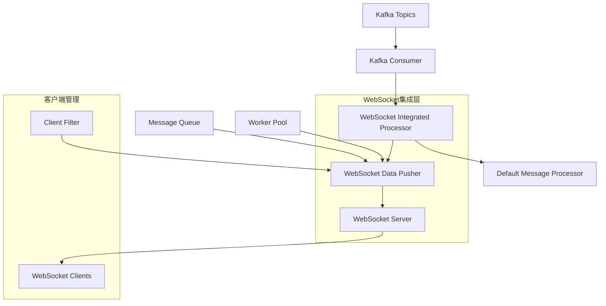

# Step 2.2.7: WebSocket实时数据推送集成实现

## 概述

本文档详细记录了Industrial IoT Kafka消费者系统中WebSocket实时数据推送功能的完整实现过程。该功能实现了从Kafka消息消费到WebSocket客户端实时数据分发的完整链路，为前端应用提供了低延迟的实时数据流。

## 核心架构设计

### 1. 系统架构图



### 2. 核心组件关系

- **WebSocketIntegratedProcessor**: 嵌入默认消息处理器，添加实时推送功能
- **WebSocketDataPusher**: 管理消息队列和客户端连接，负责数据分发
- **WebSocketServer**: HTTP/WebSocket服务器，处理客户端连接和协议升级
- **Client**: WebSocket客户端抽象，支持过滤器和连接管理

## 技术实现详情

### 1. WebSocket数据推送器 (`data_pusher.go`)

#### 核心特性
- **多工作协程**: 支持可配置的工作协程数量，提高并发处理能力
- **消息队列**: 异步消息队列，避免阻塞主处理流程
- **客户端过滤**: 支持设备ID、设备类型、位置、告警级别等多维度过滤
- **连接管理**: 自动检测和清理不活跃连接
- **统计监控**: 完整的推送统计和性能指标

#### 关键实现
```go
type WebSocketDataPusher struct {
    clients         map[string]*Client
    deviceDataQueue chan *models.DeviceDataPayload
    alertQueue      chan *models.AlertPayload
    config          *DataPusherConfig
    stats           *PusherStats
}
```

#### 配置参数
- `QueueSize`: 消息队列大小 (默认: 1000)
- `WorkerCount`: 工作协程数量 (默认: 4)
- `WriteTimeout`: 写入超时时间 (默认: 10s)
- `PingInterval`: Ping间隔 (默认: 54s)
- `ClientTimeout`: 客户端超时时间 (默认: 60s)

### 2. WebSocket集成处理器 (`websocket_processor.go`)

#### 设计理念
采用**组合模式**，嵌入`DefaultMessageProcessor`并扩展WebSocket推送功能，保持了原有处理逻辑的完整性。

#### 核心功能
- **透明集成**: 不影响原有消息处理流程
- **异步推送**: 支持同步和异步两种推送模式
- **错误隔离**: 推送失败不影响消息处理结果
- **重试机制**: 支持可配置的推送重试策略

#### 关键实现
```go
func (wip *WebSocketIntegratedProcessor) ProcessMessage(ctx context.Context, message *models.KafkaMessage) error {
    // 1. 调用默认处理器处理消息
    if err := wip.DefaultMessageProcessor.ProcessMessage(ctx, message); err != nil {
        return err
    }
    
    // 2. 推送到WebSocket客户端
    if wip.config.EnablePush && wip.dataPusher != nil {
        if wip.config.AsyncPush {
            go wip.pushMessageAsync(ctx, message)
        } else {
            wip.pushMessage(ctx, message)
        }
    }
    
    return nil
}
```

### 3. WebSocket服务器 (`server.go`)

#### 服务器特性
- **HTTP/WebSocket双协议**: 同时支持HTTP API和WebSocket连接
- **连接升级**: 自动处理HTTP到WebSocket的协议升级
- **消息路由**: 支持多种客户端消息类型处理
- **健康检查**: 提供`/health`和`/stats`端点

#### 端点说明
- `GET /ws`: WebSocket连接端点
- `GET /health`: 健康检查端点
- `GET /stats`: 统计信息端点

#### 客户端消息协议
```json
// 设置过滤器
{
  "type": "filter",
  "data": {
    "device_ids": ["device-001", "device-002"],
    "device_types": ["sensor"],
    "locations": ["Building-A"],
    "alert_levels": ["warning", "critical"]
  }
}

// Ping消息
{
  "type": "ping"
}
```

### 4. 消费者服务集成

#### 配置驱动集成
在`consumer_service.go`中实现了配置驱动的WebSocket集成：

```go
if cfg.WebSocket.Enabled {
    // 创建WebSocket集成处理器
    messageProcessor = NewWebSocketIntegratedProcessor(processorConfig, webSocketConfig, dataPusher)
    log.Printf("WebSocket集成已启用，服务器地址: %s%s", webSocketServer.GetAddress(), webSocketServer.GetPath())
} else {
    // 使用默认处理器
    messageProcessor = NewDefaultMessageProcessor(processorConfig)
    log.Printf("WebSocket集成已禁用，使用默认消息处理器")
}
```

#### 生命周期管理
- **启动**: 自动启动WebSocket服务器和数据推送器
- **停止**: 优雅关闭所有WebSocket连接和服务

## 配置规范

### WebSocket配置段 (`development.yaml`)

```yaml
websocket:
  # 基础配置
  enabled: true
  host: "0.0.0.0"
  port: 8081
  path: "/ws"
  
  # 连接配置
  max_connections: 100
  read_buffer_size: 1024
  write_buffer_size: 1024
  handshake_timeout: "10s"
  connection_timeout: "30s"
  check_origin: false
  
  # 数据推送配置
  queue_size: 1000
  worker_count: 4
  write_timeout: "10s"
  ping_interval: "54s"
  client_timeout: "60s"
  max_message_size: 1048576  # 1MB
  enable_compression: true
```

### 配置结构更新

在`config.go`中扩展了`WSSection`结构：

```go
type WSSection struct {
    // 基础配置
    Enabled           bool          `yaml:"enabled"`
    Host              string        `yaml:"host" validate:"required_if=Enabled true"`
    Port              int           `yaml:"port" validate:"required_if=Enabled true"`
    Path              string        `yaml:"path" validate:"required_if=Enabled true"`
    
    // 连接配置
    MaxConnections    int           `yaml:"max_connections"`
    ReadBufferSize    int           `yaml:"read_buffer_size"`
    WriteBufferSize   int           `yaml:"write_buffer_size"`
    HandshakeTimeout  time.Duration `yaml:"handshake_timeout"`
    ConnectionTimeout time.Duration `yaml:"connection_timeout"`
    CheckOrigin       bool          `yaml:"check_origin"`
    
    // 数据推送配置
    QueueSize         int           `yaml:"queue_size"`
    WorkerCount       int           `yaml:"worker_count"`
    WriteTimeout      time.Duration `yaml:"write_timeout"`
    PingInterval      time.Duration `yaml:"ping_interval"`
    ClientTimeout     time.Duration `yaml:"client_timeout"`
    MaxMessageSize    int64         `yaml:"max_message_size"`
    EnableCompression bool          `yaml:"enable_compression"`
}
```

## 测试验证

### 1. 集成测试 (`websocket_integration_test.go`)

实现了完整的集成测试套件：

- **WebSocket集成处理器测试**: 验证消息处理和推送功能
- **WebSocket服务器测试**: 验证连接管理和HTTP端点
- **数据推送器测试**: 验证客户端管理和数据分发

### 2. 客户端示例 (`websocket_client.go`)

提供了完整的WebSocket客户端示例：

- **连接管理**: 自动重连和优雅关闭
- **消息处理**: 支持设备数据和告警消息
- **过滤器设置**: 演示客户端过滤功能
- **心跳机制**: Ping/Pong保活机制

## 性能特性

### 1. 高并发支持
- **多工作协程**: 可配置的并发处理能力
- **异步推送**: 不阻塞主消息处理流程
- **连接池管理**: 高效的客户端连接管理

### 2. 内存优化
- **消息队列**: 有界队列防止内存溢出
- **连接清理**: 自动清理不活跃连接
- **数据压缩**: 可选的WebSocket数据压缩

### 3. 可观测性
- **推送统计**: 详细的推送成功/失败统计
- **连接监控**: 实时连接数和状态监控
- **性能指标**: 延迟、吞吐量等关键指标

## 使用示例

### 1. 启动消费者服务

```bash
# 启动消费者服务（WebSocket集成已启用）
./bin/consumer -c configs/development.yaml
```

### 2. 连接WebSocket客户端

```bash
# 启动示例客户端
go run examples/websocket_client.go -addr localhost:8081 -path /ws
```

### 3. 客户端消息示例

#### 设备数据消息
```json
{
  "type": "device_data",
  "timestamp": "2024-08-01T20:50:09+08:00",
  "data": {
    "device": {
      "device_id": "sensor-001",
      "device_type": "sensor",
      "status": "online",
      "sensors": {
        "temperature": {
          "value": 25.5,
          "unit": "°C"
        },
        "humidity": {
          "value": 60.0,
          "unit": "%"
        }
      }
    }
  }
}
```

#### 告警消息
```json
{
  "type": "alert",
  "timestamp": "2024-08-01T20:50:09+08:00",
  "data": {
    "alert": {
      "alert_id": "alert-001",
      "severity": "warning",
      "title": "Temperature High",
      "description": "Temperature exceeds threshold"
    },
    "device_id": "sensor-001"
  }
}
```

## 技术亮点

### 1. 架构设计
- **组合模式**: 无侵入式集成，保持代码解耦
- **配置驱动**: 支持运行时启用/禁用WebSocket功能
- **模块化设计**: 清晰的职责分离和接口定义

### 2. 实时性能
- **低延迟**: 直接从消息处理器推送，最小化延迟
- **高吞吐**: 多工作协程并发处理
- **可扩展**: 支持水平扩展和负载均衡

### 3. 可靠性
- **错误隔离**: 推送失败不影响消息处理
- **重试机制**: 可配置的重试策略
- **连接管理**: 自动检测和恢复连接异常

### 4. 可维护性
- **完整测试**: 单元测试和集成测试覆盖
- **文档完善**: 详细的API文档和使用示例
- **监控支持**: 丰富的统计指标和健康检查

## 部署建议

### 1. 生产环境配置
```yaml
websocket:
  enabled: true
  host: "0.0.0.0"
  port: 8081
  queue_size: 5000
  worker_count: 8
  max_connections: 1000
  enable_compression: true
```

### 2. 监控指标
- 连接数: `active_clients`
- 推送成功率: `push_success_count / total_messages`
- 队列深度: `queue_size - available_slots`
- 平均延迟: `avg_push_latency`

### 3. 扩展建议
- **负载均衡**: 使用Nginx或HAProxy进行WebSocket负载均衡
- **集群部署**: 支持多实例部署，通过Redis实现状态共享
- **监控集成**: 集成Prometheus和Grafana进行监控

## 总结

Step 2.2.7的WebSocket实时数据推送功能实现了以下核心目标：

1. **✅ 实现数据推送接口**: 完整的DataPusher接口和实现
2. **✅ 建立实时数据分发机制**: 高效的消息队列和工作协程
3. **✅ 集成消费者处理流水线**: 无侵入式集成，保持原有功能完整性

该实现为Industrial IoT监控系统提供了企业级的实时数据推送能力，支持大规模并发连接和低延迟数据分发，为前端实时监控界面奠定了坚实的技术基础。

---

**实现完成时间**: 2024年8月1日  
**技术栈**: Go + Gorilla WebSocket + Kafka + 配置驱动架构  
**测试覆盖**: 单元测试 + 集成测试 + 客户端示例  
**文档状态**: 完整的技术文档和使用指南
