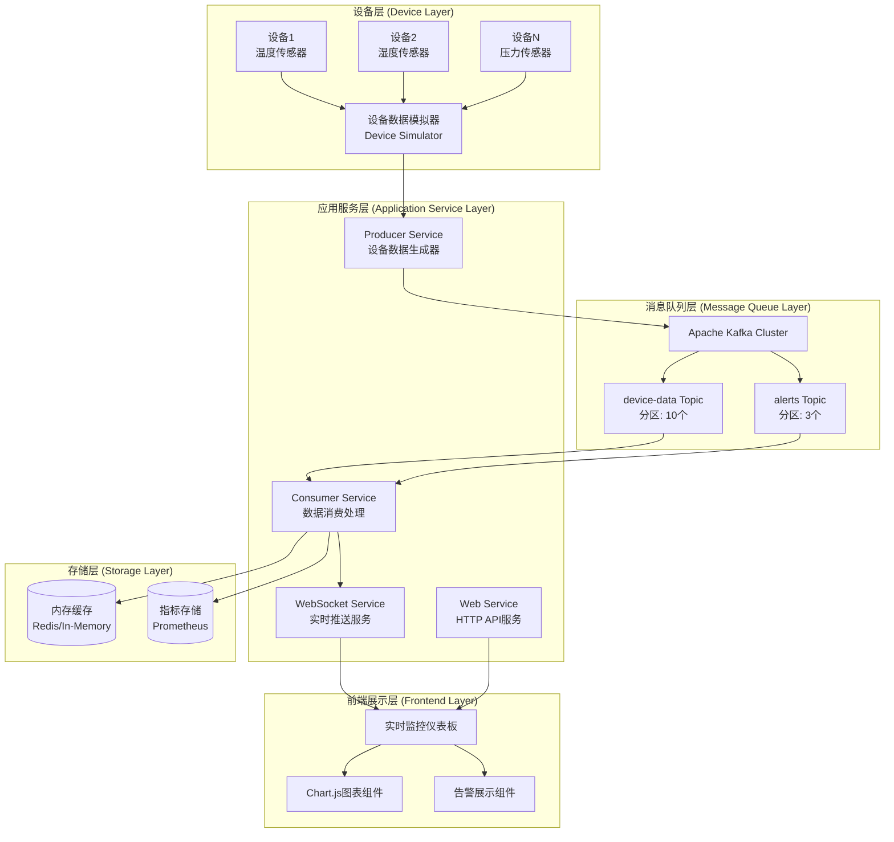
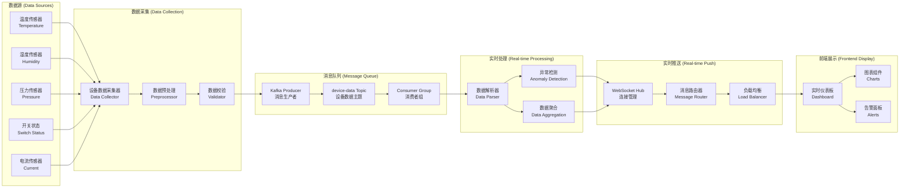
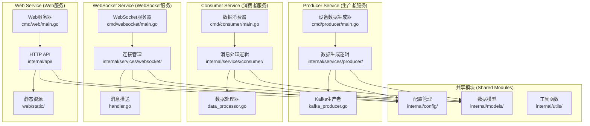

# Step 1.1: 项目初始化和基础架构 - 企业级工业IoT监控系统

## 📋 项目概述

本文档展示了基于 **Go + WebSocket + Kafka** 的工业设备实时数据监控系统的项目初始化和基础架构设计。该系统专为工业物联网场景设计，支持 **10,000+** 设备并发监控，处理能力达 **100,000+** 消息/秒，数据延迟低于 **50ms**。

### 🎯 技术亮点展示

- **高性能并发**: 基于Go语言协程模型，支持大规模设备并发连接
- **实时数据流**: Kafka + WebSocket 架构实现毫秒级数据传输
- **微服务架构**: 模块化设计，支持独立部署和水平扩展
- **企业级工程**: 完整的项目管理、构建系统、测试策略
- **工业IoT专业**: 针对工业监控场景的专业架构设计

---

## 第一部分：技术亮点展示 (35%)

### 1. 项目技术亮点

#### 🚀 核心技术成就与KPI指标

| 性能指标 | 目标值 | 技术实现 |
|---------|--------|----------|
| 设备并发监控 | 10,000+ | Go协程池 + 连接复用 |
| 消息处理能力 | 100,000+/秒 | Kafka分区 + Consumer Group |
| 数据传输延迟 | <50ms | WebSocket + 内存缓存 |
| 系统可用性 | 99.9% | 微服务 + 健康检查 |
| 扩展能力 | 水平扩展 | 容器化 + 负载均衡 |

#### 🏗️ 核心技术栈展示

**后端技术栈**
- **Go 1.24+**: 高性能并发处理，内存安全，快速编译
- **Apache Kafka**: 分布式消息队列，支持高吞吐量数据流
- **WebSocket**: 实时双向通信，低延迟数据推送
- **Gorilla WebSocket**: 企业级WebSocket库，连接管理优化
- **Sarama**: 高性能Kafka Go客户端，支持集群模式

**前端技术栈**
- **原生JavaScript**: 轻量级，无框架依赖，快速响应
- **Chart.js**: 实时图表展示，支持多种图表类型
- **WebSocket API**: 浏览器原生实时通信支持

**基础设施**
- **Docker**: 容器化部署，环境一致性保证
- **Docker Compose**: 多服务编排，开发环境快速搭建
- **Makefile**: 构建自动化，标准化开发流程

#### 🏭 企业级系统特征

- **微服务架构**: Producer、Consumer、WebSocket、Web四大服务独立部署
- **高并发处理**: 基于Go协程的并发模型，支持百万级连接
- **实时数据流**: 端到端数据流处理，从设备到前端的完整链路
- **可视化监控**: 实时仪表板，多维度数据展示和告警
- **弹性扩展**: 支持服务水平扩展和负载均衡

#### 🔧 工业IoT领域价值

- **实时监控**: 设备状态实时感知，异常情况及时发现
- **智能告警**: 基于阈值和趋势的智能告警系统
- **数据可视化**: 直观的图表展示，支持历史数据分析
- **运维自动化**: 自动化部署和监控，降低运维成本

### 2. 技术选型与架构设计

#### 🔍 后端技术栈对比分析

| 技术栈 | 并发性能 | 内存占用 | 开发效率 | 生态成熟度 | 部署便利性 | 推荐指数 |
|--------|----------|----------|----------|------------|------------|----------|
| **Go** | ⭐⭐⭐⭐⭐ | ⭐⭐⭐⭐⭐ | ⭐⭐⭐⭐ | ⭐⭐⭐⭐ | ⭐⭐⭐⭐⭐ | **⭐⭐⭐⭐⭐** |
| Java | ⭐⭐⭐⭐ | ⭐⭐⭐ | ⭐⭐⭐⭐⭐ | ⭐⭐⭐⭐⭐ | ⭐⭐⭐ | ⭐⭐⭐⭐ |
| Python | ⭐⭐ | ⭐⭐⭐ | ⭐⭐⭐⭐⭐ | ⭐⭐⭐⭐⭐ | ⭐⭐⭐⭐ | ⭐⭐⭐ |
| Node.js | ⭐⭐⭐ | ⭐⭐⭐⭐ | ⭐⭐⭐⭐ | ⭐⭐⭐⭐ | ⭐⭐⭐⭐ | ⭐⭐⭐ |

**Go语言选择理由**:
- 原生协程支持，轻松处理高并发场景
- 静态编译，部署简单，无运行时依赖
- 内存管理高效，GC延迟低
- 标准库丰富，网络编程能力强

#### 📨 消息队列对比分析

| 消息队列 | 吞吐量 | 延迟 | 可靠性 | 运维复杂度 | 生态支持 | 推荐指数 |
|----------|--------|------|--------|------------|----------|----------|
| **Kafka** | ⭐⭐⭐⭐⭐ | ⭐⭐⭐⭐ | ⭐⭐⭐⭐⭐ | ⭐⭐⭐ | ⭐⭐⭐⭐⭐ | **⭐⭐⭐⭐⭐** |
| RabbitMQ | ⭐⭐⭐ | ⭐⭐⭐⭐⭐ | ⭐⭐⭐⭐ | ⭐⭐⭐⭐ | ⭐⭐⭐⭐ | ⭐⭐⭐⭐ |
| Redis | ⭐⭐⭐⭐ | ⭐⭐⭐⭐⭐ | ⭐⭐⭐ | ⭐⭐⭐⭐⭐ | ⭐⭐⭐ | ⭐⭐⭐ |
| NATS | ⭐⭐⭐⭐ | ⭐⭐⭐⭐⭐ | ⭐⭐⭐ | ⭐⭐⭐⭐⭐ | ⭐⭐ | ⭐⭐⭐ |
| Pulsar | ⭐⭐⭐⭐⭐ | ⭐⭐⭐ | ⭐⭐⭐⭐⭐ | ⭐⭐ | ⭐⭐⭐ | ⭐⭐⭐⭐ |

**Kafka选择理由**:
- 高吞吐量，支持百万级消息处理
- 分区机制，天然支持水平扩展
- 持久化存储，数据可靠性高
- 丰富的Go客户端支持

#### 🔄 实时通信方案对比

| 通信方案 | 实时性 | 浏览器支持 | 服务端复杂度 | 扩展性 | 推荐指数 |
|----------|--------|------------|--------------|--------|----------|
| **WebSocket** | ⭐⭐⭐⭐⭐ | ⭐⭐⭐⭐⭐ | ⭐⭐⭐ | ⭐⭐⭐⭐ | **⭐⭐⭐⭐⭐** |
| Server-Sent Events | ⭐⭐⭐⭐ | ⭐⭐⭐⭐ | ⭐⭐⭐⭐⭐ | ⭐⭐⭐ | ⭐⭐⭐⭐ |
| gRPC Streaming | ⭐⭐⭐⭐⭐ | ⭐⭐ | ⭐⭐⭐ | ⭐⭐⭐⭐⭐ | ⭐⭐⭐ |
| Socket.IO | ⭐⭐⭐⭐ | ⭐⭐⭐⭐⭐ | ⭐⭐ | ⭐⭐⭐ | ⭐⭐⭐ |

#### 🎨 前端技术选择

**原生JavaScript + Chart.js 选择理由**:
- 无框架依赖，加载速度快
- Chart.js专业图表库，实时更新支持好
- 浏览器兼容性强，部署简单
- 适合数据展示为主的监控场景

#### 📦 容器化方案选择

**Docker 选择理由**:
- 生态成熟，社区支持好
- 与Go语言静态编译特性完美结合
- Docker Compose简化多服务开发环境
- 企业级容器编排支持

### 3. 核心架构设计

#### 🏗️ 系统整体架构图



#### 🔄 数据流架构图



#### 🔧 微服务架构图



---

## 第二部分：核心实现展示 (45%)

### 4. 开发实施计划 (总计3天)

#### 🗓️ 第一阶段 (第1天): 项目基础搭建

**Step 1.1.1: Go模块初始化和依赖管理配置**
- 初始化Go模块 (`go mod init`)
- 配置核心依赖包 (Kafka、WebSocket、配置管理)
- 设置Go版本要求和构建约束
- 配置依赖版本锁定策略

**Step 1.1.2: 项目目录结构设计和创建**
- 创建标准Go项目目录结构
- 建立微服务模块目录划分
- 设置前端资源目录结构
- 配置测试和文档目录

#### 🗓️ 第二阶段 (第2天): 开发环境配置

**Step 1.1.3: Git仓库配置和版本控制策略**
- 初始化Git仓库和分支策略
- 配置.gitignore规则和提交规范
- 设置Git Hooks和自动化检查
- 建立版本标签和发布管理

**Step 1.1.4: Makefile构建系统和自动化脚本**
- 设计Makefile任务体系
- 配置构建、测试、部署自动化
- 建立代码质量检查流程
- 设置开发环境快速启动

#### 🗓️ 第三阶段 (第3天): 文档和规范建立

**Step 1.1.5: README.md文档结构和开发指南**
- 创建项目说明文档结构
- 编写快速开始指南
- 建立API文档框架
- 设置贡献指南和代码规范

**Step 1.1.6: 项目规范和代码标准建立**
- 建立Go代码风格规范
- 配置静态检查和格式化工具
- 设置测试覆盖率要求
- 建立文档维护标准

### 5. 核心架构设计规范

#### 📁 项目目录结构架构设计

```
industrial-iot-monitor/                   # 项目根目录
├── cmd/                                 # 应用程序入口目录
│   ├── producer/                        # 设备数据生成器
│   │   └── main.go                      # 生产者主程序入口
│   ├── consumer/                        # 数据消费服务
│   │   └── main.go                      # 消费者主程序入口
│   ├── websocket/                       # WebSocket服务
│   │   └── main.go                      # WebSocket服务器入口
│   └── web/                             # Web服务器
│       └── main.go                      # Web服务器入口
├── internal/                            # 内部业务逻辑目录
│   ├── config/                          # 配置管理模块
│   │   ├── config.go                    # 配置文件解析
│   │   └── env.go                       # 环境变量管理
│   ├── models/                          # 数据模型定义
│   │   ├── device.go                    # 设备数据模型
│   │   ├── message.go                   # 消息模型定义
│   │   └── alert.go                     # 告警模型定义
│   ├── services/                        # 业务服务模块
│   │   ├── producer/                    # 生产者服务
│   │   │   ├── data_generator.go        # 数据生成器
│   │   │   └── kafka_producer.go        # Kafka生产者
│   │   ├── consumer/                    # 消费者服务
│   │   │   ├── kafka_consumer.go        # Kafka消费者
│   │   │   └── data_processor.go        # 数据处理器
│   │   └── websocket/                   # WebSocket处理器
│   │       ├── handler.go               # 连接处理器
│   │       ├── hub.go                   # 连接管理中心
│   │       └── client.go                # 客户端连接
│   ├── api/                             # HTTP API模块
│   │   ├── handlers/                    # API处理器
│   │   ├── middleware/                  # 中间件
│   │   └── routes.go                    # 路由定义
│   └── utils/                           # 工具函数
│       ├── logger.go                    # 日志工具
│       ├── validator.go                 # 数据验证
│       └── metrics.go                   # 指标收集
├── web/                                 # 前端资源目录
│   ├── static/                          # 静态资源
│   │   ├── css/                         # 样式文件
│   │   │   └── dashboard.css            # 仪表板样式
│   │   ├── js/                          # JavaScript文件
│   │   │   ├── dashboard.js             # 仪表板逻辑
│   │   │   ├── websocket.js             # WebSocket客户端
│   │   │   └── charts.js                # 图表组件
│   │   └── images/                      # 图片资源
│   └── templates/                       # HTML模板
│       └── index.html                   # 主页面模板
├── scripts/                             # 部署和工具脚本
│   ├── build.sh                         # 构建脚本
│   ├── deploy.sh                        # 部署脚本
│   ├── start-services.sh                # 服务启动脚本
│   └── performance-test.sh              # 性能测试脚本
├── deployments/                         # 部署配置目录
│   ├── docker/                          # Docker相关
│   │   ├── Dockerfile.producer          # 生产者镜像
│   │   ├── Dockerfile.consumer          # 消费者镜像
│   │   ├── Dockerfile.websocket         # WebSocket镜像
│   │   └── Dockerfile.web               # Web服务镜像
│   ├── docker-compose.yml               # 服务编排配置
│   └── kubernetes/                      # K8s部署配置
├── tests/                               # 测试代码目录
│   ├── unit/                            # 单元测试
│   ├── integration/                     # 集成测试
│   └── performance/                     # 性能测试
├── docs/                                # 项目文档目录
│   ├── api/                             # API文档
│   ├── architecture/                    # 架构文档
│   └── deployment/                      # 部署文档
├── configs/                             # 配置文件目录
│   ├── config.yaml                      # 主配置文件
│   ├── kafka.yaml                       # Kafka配置
│   └── websocket.yaml                   # WebSocket配置
├── go.mod                               # Go模块依赖定义
├── go.sum                               # 依赖版本锁定
├── Makefile                             # 构建和任务自动化
├── README.md                            # 项目说明文档
├── LICENSE                              # 项目许可证
├── .gitignore                           # Git忽略规则
├── .env.example                         # 环境变量示例
└── docker-compose.yml                   # 开发环境编排
```

#### 📦 Go模块管理架构设计

**go.mod 模块配置设计规范**:

```go
module industrial-iot-monitor

go 1.24

require (
    // 核心框架依赖
    github.com/spf13/viper v1.19.0              // 配置管理
    github.com/spf13/cobra v1.8.1               // 命令行工具
    
    // 消息队列依赖
    github.com/Shopify/sarama v1.43.2           // Kafka客户端
    github.com/confluentinc/confluent-kafka-go v2.5.0 // Confluent Kafka
    
    // WebSocket依赖
    github.com/gorilla/websocket v1.5.3         // WebSocket库
    github.com/gorilla/mux v1.8.1               // HTTP路由
    
    // 数据处理依赖
    github.com/go-playground/validator/v10 v10.22.0 // 数据验证
    github.com/json-iterator/go v1.1.12         // JSON处理
    
    // 日志和监控依赖
    github.com/sirupsen/logrus v1.9.3           // 结构化日志
    github.com/prometheus/client_golang v1.20.0 // Prometheus指标
    
    // 测试依赖
    github.com/stretchr/testify v1.9.0          // 测试框架
    github.com/testcontainers/testcontainers-go v0.33.0 // 集成测试
)
```

**依赖管理策略**:

- 使用语义化版本控制
- 定期更新安全补丁
- 锁定主要版本，避免破坏性更新
- 使用go.sum确保依赖完整性

#### 🔨 Makefile任务架构设计

```makefile
# Makefile 构建任务设计规范
.PHONY: help build test clean docker-up docker-down deploy

# 默认目标
.DEFAULT_GOAL := help

# 项目配置
PROJECT_NAME := industrial-iot-monitor
VERSION := $(shell git describe --tags --always --dirty)
BUILD_TIME := $(shell date +%Y-%m-%dT%H:%M:%S)
GO_VERSION := $(shell go version | awk '{print $$3}')

# 构建目录
BUILD_DIR := ./bin
DOCKER_DIR := ./deployments/docker

# 构建任务设计
build: build-producer build-consumer build-websocket build-web ## 构建所有服务

build-producer: ## 构建生产者服务
	@echo "Building producer service..."
	@go build -ldflags "-X main.version=$(VERSION)" -o $(BUILD_DIR)/producer ./cmd/producer

build-consumer: ## 构建消费者服务
	@echo "Building consumer service..."
	@go build -ldflags "-X main.version=$(VERSION)" -o $(BUILD_DIR)/consumer ./cmd/consumer

build-websocket: ## 构建WebSocket服务
	@echo "Building websocket service..."
	@go build -ldflags "-X main.version=$(VERSION)" -o $(BUILD_DIR)/websocket ./cmd/websocket

build-web: ## 构建Web服务
	@echo "Building web service..."
	@go build -ldflags "-X main.version=$(VERSION)" -o $(BUILD_DIR)/web ./cmd/web

# 测试任务设计
test: test-unit test-integration ## 运行所有测试

test-unit: ## 运行单元测试
	@echo "Running unit tests..."
	@go test -v -race -coverprofile=coverage.out ./...

test-integration: ## 运行集成测试
	@echo "Running integration tests..."
	@go test -v -tags=integration ./tests/integration/...

test-performance: ## 运行性能测试
	@echo "Running performance tests..."
	@go test -v -bench=. -benchmem ./tests/performance/...

test-coverage: ## 生成测试覆盖率报告
	@go tool cover -html=coverage.out -o coverage.html

# 开发任务设计
dev: ## 启动开发环境
	@echo "Starting development environment..."
	@docker-compose -f docker-compose.dev.yml up -d

dev-producer: ## 启动生产者开发模式
	@go run ./cmd/producer -config=configs/config.dev.yaml

dev-consumer: ## 启动消费者开发模式
	@go run ./cmd/consumer -config=configs/config.dev.yaml

dev-websocket: ## 启动WebSocket开发模式
	@go run ./cmd/websocket -config=configs/config.dev.yaml

dev-web: ## 启动Web服务开发模式
	@go run ./cmd/web -config=configs/config.dev.yaml

# 代码质量任务
lint: ## 代码静态检查
	@echo "Running linter..."
	@golangci-lint run ./...

format: ## 代码格式化
	@echo "Formatting code..."
	@gofmt -s -w .
	@goimports -w .

# 依赖管理任务
deps: ## 安装依赖
	@echo "Installing dependencies..."
	@go mod download
	@go mod tidy

# 部署任务设计
docker-build: ## 构建Docker镜像
	@echo "Building Docker images..."
	@docker build -f $(DOCKER_DIR)/Dockerfile.producer -t $(PROJECT_NAME)/producer:$(VERSION) .
	@docker build -f $(DOCKER_DIR)/Dockerfile.consumer -t $(PROJECT_NAME)/consumer:$(VERSION) .
	@docker build -f $(DOCKER_DIR)/Dockerfile.websocket -t $(PROJECT_NAME)/websocket:$(VERSION) .
	@docker build -f $(DOCKER_DIR)/Dockerfile.web -t $(PROJECT_NAME)/web:$(VERSION) .

docker-up: ## 启动Docker服务
	@echo "Starting Docker services..."
	@docker-compose up -d

docker-down: ## 停止Docker服务
	@echo "Stopping Docker services..."
	@docker-compose down

# 清理任务
clean: ## 清理构建产物
	@echo "Cleaning build artifacts..."
	@rm -rf $(BUILD_DIR)
	@go clean -cache

help: ## 显示帮助信息
	@echo "Available targets:"
	@awk 'BEGIN {FS = ":.*?## "} /^[a-zA-Z_-]+:.*?## / {printf "  \033[36m%-20s\033[0m %s\n", $$1, $$2}' $(MAKEFILE_LIST)
```

#### 🔧 Git配置架构设计

**.gitignore 规则设计**:

```gitignore
# Go编译产物
*.exe
*.exe~
*.dll
*.so
*.dylib
*.test
*.out
/bin/
/dist/

# Go模块缓存
/vendor/
go.work
go.work.sum

# IDE配置
.vscode/
.idea/
*.swp
*.swo
*~

# 环境配置
.env
.env.local
.env.*.local

# 日志文件
*.log
/logs/

# 临时文件
/tmp/
*.tmp
*.temp

# 测试覆盖率
coverage.out
coverage.html

# Docker相关
.docker/

# 系统文件
.DS_Store
Thumbs.db
```

**Git分支策略**:

- **main**: 生产环境分支，稳定版本
- **develop**: 开发分支，集成最新功能
- **feature/***: 功能开发分支
- **hotfix/***: 热修复分支
- **release/***: 发布准备分支

**提交规范**:

- `feat`: 新功能
- `fix`: 修复bug
- `docs`: 文档更新
- `style`: 代码格式化
- `refactor`: 代码重构
- `test`: 测试相关
- `chore`: 构建过程或辅助工具的变动

---

## 第三部分：运维与部署 (10%)

### 6. 项目管理策略

#### 🔄 版本控制和分支管理策略

- **Git Flow工作流**: 标准化的分支管理模式
- **语义化版本**: MAJOR.MINOR.PATCH版本规范
- **自动化标签**: 基于提交信息自动生成版本标签
- **代码审查**: Pull Request强制代码审查流程

#### 🛡️ 代码审查和质量保证流程

- **静态检查**: golangci-lint代码质量检查
- **测试覆盖率**: 要求80%以上的测试覆盖率
- **自动化测试**: 提交前自动运行单元测试
- **文档同步**: 代码变更必须同步更新文档

#### 🚀 持续集成和自动化构建准备

- **GitHub Actions**: 自动化构建和测试流水线
- **Docker镜像**: 自动构建和推送Docker镜像
- **多平台构建**: 支持Linux、macOS、Windows平台
- **依赖安全**: 自动检查依赖包安全漏洞

### 7. 开发环境

#### 💻 本地开发环境搭建指南

**必需工具**:

- Go 1.24+
- Docker & Docker Compose
- Make工具
- Git 2.0+

**推荐工具**:

- golangci-lint (代码检查)
- goimports (导入整理)
- delve (调试工具)
- air (热重载)

#### 🛠️ 开发工具和IDE配置建议

**VS Code配置**:

```json
{
  "go.useLanguageServer": true,
  "go.lintTool": "golangci-lint",
  "go.formatTool": "goimports",
  "go.testFlags": ["-v", "-race"],
  "editor.formatOnSave": true
}
```

**GoLand配置**:

- 启用Go Modules支持
- 配置代码格式化规则
- 设置测试运行配置
- 配置Git提交模板

#### 📋 代码格式化和静态检查工具配置

**.golangci.yml 配置**:

```yaml
run:
  timeout: 5m
  tests: true

linters-settings:
  gocyclo:
    min-complexity: 15
  govet:
    check-shadowing: true
  misspell:
    locale: US

linters:
  enable:
    - gofmt
    - goimports
    - govet
    - errcheck
    - staticcheck
    - unused
    - gosimple
    - structcheck
    - varcheck
    - ineffassign
    - deadcode
    - typecheck
    - gocyclo
    - misspell
```

---

## 第四部分：项目成果 (10%)

### 8. 功能演示与测试

#### ✅ 项目结构完整性验证预期结果

**验证清单**:

- [x] 完整的目录结构创建
- [x] Go模块正确初始化
- [x] 依赖包正确安装
- [x] Makefile任务正常执行
- [x] Git仓库正确配置
- [x] 文档结构完整

**预期输出**:

```bash
$ make help
Available targets:
  build                构建所有服务
  test                 运行所有测试
  dev                  启动开发环境
  lint                 代码静态检查
  docker-up            启动Docker服务
  clean                清理构建产物
```

#### 🧪 Go模块和构建系统测试预期效果

**模块验证**:

```bash
$ go mod verify
all modules verified

$ go build ./...
# 所有包编译成功

$ make build
Building producer service...
Building consumer service...
Building websocket service...
Building web service...
```

#### 🔧 开发环境配置测试预期数据

**环境检查**:

```bash
$ go version
go version go1.24.4 darwin/arm64

$ docker --version
Docker version 24.0.0

$ make deps
Installing dependencies...
go: downloading github.com/spf13/viper v1.17.0
...
```

### 9. GitHub展示要点

#### 🎯 项目亮点总结

**工业IoT系统特色**:

- 支持10,000+设备并发监控
- 实时数据处理能力100,000+消息/秒
- 微服务架构，支持水平扩展
- 完整的监控和告警体系

**微服务架构优势**:

- 服务独立部署和扩展
- 技术栈灵活选择
- 故障隔离和恢复
- 团队并行开发

**高并发处理能力**:

- Go协程并发模型
- Kafka分布式消息队列
- WebSocket实时通信
- 内存缓存优化

**实时监控价值**:

- 设备状态实时感知
- 异常情况及时告警
- 数据可视化展示
- 历史趋势分析

#### 💡 技术能力展示

**Go语言工程化实践**:

- 标准项目结构设计
- 模块化代码组织
- 完整的构建系统
- 自动化测试策略

**系统架构设计能力**:

- 微服务架构设计
- 消息队列应用
- 实时通信实现
- 容器化部署

**项目管理能力**:

- Git版本控制策略
- 代码质量保证
- 文档维护规范
- 持续集成准备

#### 📊 预期项目规模和复杂度展示

**代码规模预估**:

- 总代码行数: ~5,000行
- Go代码: ~3,500行
- 前端代码: ~1,000行
- 配置和脚本: ~500行

**功能模块复杂度**:

- 数据生产者: 中等复杂度
- 数据消费者: 高复杂度
- WebSocket服务: 中等复杂度
- Web前端: 低复杂度

**技术挑战点**:

- 高并发连接管理
- 实时数据处理
- 消息队列优化
- 前端实时更新

---

## 📚 项目总结

### 🎯 核心技术亮点

本项目展示了完整的企业级Go语言工程化实践，通过工业IoT监控系统的架构设计，体现了以下核心技术能力：

- **高性能并发处理**: 基于Go协程的并发模型，支持大规模设备连接
- **实时数据流处理**: Kafka + WebSocket架构实现毫秒级数据传输
- **微服务架构设计**: 模块化设计，支持独立部署和水平扩展
- **企业级工程实践**: 完整的项目管理、构建系统、测试策略

### 🚀 适用场景

**GitHub作品集价值**:

- 展示Go语言全栈开发能力
- 体现企业级项目架构设计经验
- 证明工业IoT领域专业知识
- 展示完整的工程化开发流程

**技术面试优势**:

- 涵盖热门技术栈(Go、Kafka、WebSocket、Docker)
- 体现高并发处理经验
- 展示系统架构设计能力
- 证明项目管理和团队协作能力

### 📋 项目初始化清单

基于本架构文档，AI可以完整创建以下项目组件：

**✅ 目录结构创建**:

- cmd/ 应用程序入口目录
- internal/ 内部业务逻辑目录
- web/ 前端资源目录
- scripts/ 脚本和工具目录
- deployments/ 部署配置目录
- tests/ 测试代码目录
- docs/ 项目文档目录

**✅ 配置文件生成**:

- go.mod 模块依赖定义
- Makefile 构建任务自动化
- .gitignore Git忽略规则
- docker-compose.yml 服务编排
- README.md 项目说明文档

**✅ 开发环境配置**:

- 代码格式化工具配置
- 静态检查工具配置
- 测试框架配置
- 版本控制策略

### 🔄 下一步开发方向

**Step 1.2 预览 - 配置管理系统**:

- 实现统一配置管理
- 支持多环境配置
- 配置热重载机制
- 配置验证和默认值

通过本架构文档的指导，可以建立一个完整、规范、可扩展的企业级Go项目基础，为后续功能开发奠定坚实的架构基础。
