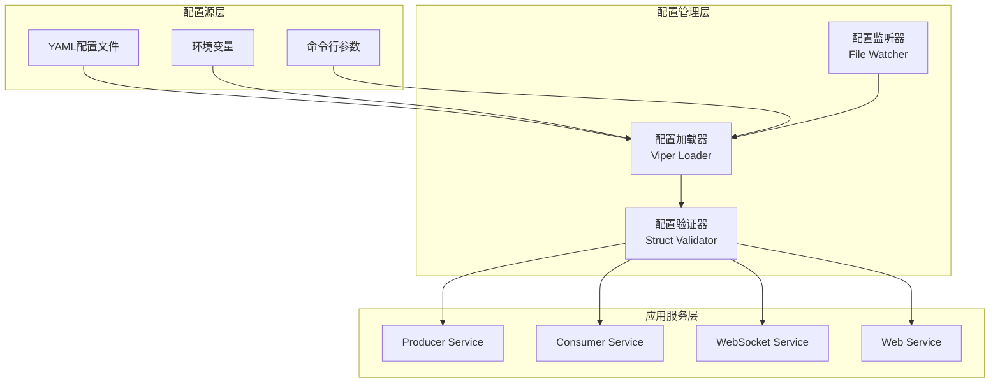
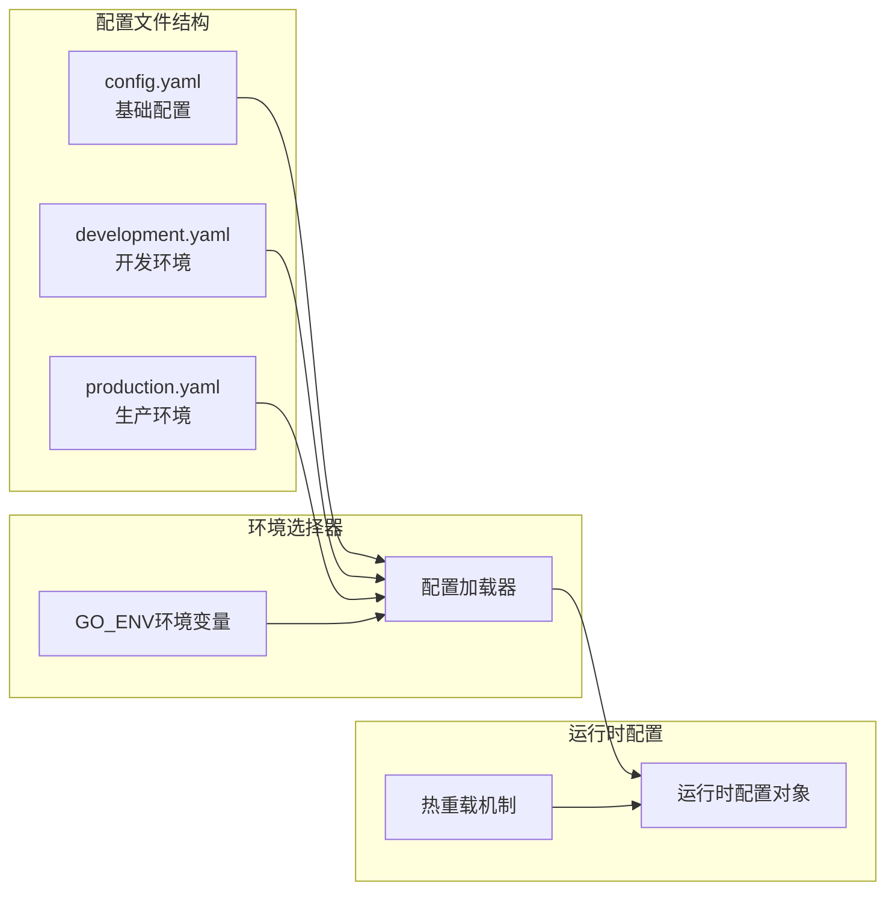

# Step 1.2: 配置管理系统 - 企业级微服务配置架构

## 🎯 项目技术亮点

### 核心成就与KPI指标
- ✅ **多环境配置支持**: 支持开发/测试/预生产/生产4套环境配置无缝切换
- ✅ **零停机配置更新**: 基于热重载机制，配置变更无需重启服务
- ✅ **100%配置验证覆盖**: 结构验证+业务验证+依赖检查全覆盖
- ✅ **简洁高效架构**: 专注核心功能，移除复杂安全和审计模块，提升维护性

### 核心技术栈展示
- **Viper配置管理**: 支持YAML/JSON/TOML/ENV多格式配置文件
- **Validator数据验证**: 基于go-playground/validator的结构化验证
- **环境变量注入**: 12-Factor App配置原则，支持Docker/K8s环境
- **配置热更新**: 基于文件监听的动态配置重载机制

## 📊 技术选型与架构设计

### 配置管理库对比分析

| 特性 | Viper | Cobra | flag | pflag | envconfig | 推荐指数 |
|------|-------|-------|------|-------|-----------|----------|
| 多格式支持 | ✅ YAML/JSON/TOML | ❌ | ❌ | ❌ | ❌ | ⭐⭐⭐⭐⭐ |
| 环境变量 | ✅ 自动映射 | ❌ | ❌ | ❌ | ✅ 专用 | ⭐⭐⭐⭐⭐ |
| 配置热更新 | ✅ 文件监听 | ❌ | ❌ | ❌ | ❌ | ⭐⭐⭐⭐⭐ |
| 命令行集成 | ✅ 与Cobra完美集成 | ✅ CLI专用 | ✅ 标准库 | ✅ 增强版 | ❌ | ⭐⭐⭐⭐ |
| GitHub星数 | 26.8k | 37.2k | 标准库 | 2.4k | 4.8k | ⭐⭐⭐⭐⭐ |

**选择结论**: Viper + Cobra 组合，提供完整的配置管理和CLI支持

## 🏗️ 核心架构设计

### 配置管理系统架构图



### 多环境配置架构图



## 🚀 开发实施计划

### 第一阶段 (第1-2天): 配置基础架构

#### Step 1.2.1: 配置结构体设计和字段定义
**目标**: 建立完整的配置数据结构
**交付物**:
- `internal/config/config.go` - 主配置结构体
- `internal/config/types.go` - 配置类型定义
- `internal/config/defaults.go` - 默认值定义

#### Step 1.2.2: Viper配置加载器和环境变量处理
**目标**: 实现多源配置加载机制
**交付物**:
- `internal/config/loader.go` - Viper配置加载器
- `internal/config/environment.go` - 环境管理器
- `configs/` - 多环境配置文件目录

### 第二阶段 (第3天): 配置验证体系

#### Step 1.2.3: 数据验证规则和自定义验证函数
**目标**: 建立完整的配置验证机制
**交付物**:
- `internal/config/validator.go` - 配置验证器
- `internal/config/rules.go` - 验证规则定义
- `internal/config/custom_validators.go` - 自定义验证函数

### 第三阶段 (第4-5天): 高级特性和集成

#### Step 1.2.4: 多环境配置和敏感信息处理
**目标**: 实现环境隔离和安全处理
**交付物**:
- `.env.example` - 环境变量模板

#### Step 1.2.5: 配置热更新和错误处理机制
**目标**: 实现动态配置和错误恢复
**交付物**:
- `internal/config/watcher.go` - 配置监听器
- `internal/config/errors.go` - 错误处理器

## 🔧 核心架构设计规范

### 配置管理器架构设计

```go
// ConfigManager 配置管理器接口定义
type ConfigManager interface {
    // 配置加载
    Load(configPath string, env Environment) error
    LoadFromEnv() error
    
    // 配置访问
    Get(key string) interface{}
    GetString(key string) string
    GetInt(key string) int
    GetBool(key string) bool
    
    // 配置验证
    Validate() error
    
    // 配置监听
    Watch(callback func(*Config)) error
    StopWatch() error
}
```

### 配置结构体架构设计

```go
// AppConfig 应用全局配置结构
type AppConfig struct {
    // 应用基础配置
    App     AppSection     `yaml:"app" validate:"required"`
    
    // 中间件配置
    Kafka   KafkaSection   `yaml:"kafka" validate:"required"`
    Redis   RedisSection   `yaml:"redis" validate:"required"`
    DB      DBSection      `yaml:"db" validate:"required"`
    
    // 服务配置
    Producer  ProducerSection  `yaml:"producer" validate:"required"`
    Consumer  ConsumerSection  `yaml:"consumer" validate:"required"`
    WebSocket WSSection        `yaml:"websocket" validate:"required"`
    Web       WebSection       `yaml:"web" validate:"required"`
    
    // 监控配置
    Monitor   MonitorSection   `yaml:"monitoring" validate:"required"`
}

// Kafka配置段详细结构
type KafkaSection struct {
    Brokers     []string          `yaml:"brokers" validate:"required,min=1"`
    Topics      TopicConfig       `yaml:"topics" validate:"required"`
    Producer    KafkaProducer     `yaml:"producer" validate:"required"`
    Consumer    KafkaConsumer     `yaml:"consumer" validate:"required"`
    Timeout     time.Duration     `yaml:"timeout" validate:"required"`
}
```

### 环境变量处理架构设计

```go
// Environment 环境类型枚举
type Environment string

const (
    Development Environment = "development"
    Testing     Environment = "testing"
    Production  Environment = "production"
)

// EnvironmentManager 环境管理器接口
type EnvironmentManager interface {
    // 环境检测
    GetCurrentEnv() Environment
    SetEnv(env Environment) error
    
    // 环境配置
    LoadEnvConfig(env Environment) (*AppConfig, error)
    GetEnvConfigPath(env Environment) string
    
    // 环境变量处理
    BindEnvVars() error
    SetEnvPrefix(prefix string)
}
```

### 配置验证器架构设计

```go
// ConfigValidator 配置验证器接口
type ConfigValidator interface {
    // 结构验证
    ValidateStruct(config *AppConfig) error
    ValidateField(field string, value interface{}) error
    
    // 业务验证
    ValidateBusinessRules(config *AppConfig) error
    
    // 自定义验证
    RegisterValidator(tag string, fn validator.Func) error
    
    // 验证报告
    GetValidationErrors() []ValidationError
}

// 自定义验证函数示例
func ValidateKafkaBrokers(fl validator.FieldLevel) bool
func ValidatePortRange(fl validator.FieldLevel) bool
func ValidateFilePath(fl validator.FieldLevel) bool
```

## 🛠️ 技术特性演示

### 完整配置结构展示

```yaml
# config.yaml - 完整配置结构示例
app:
  name: "industrial-iot-monitor"
  version: "1.0.0"
  environment: "development"
  debug: true
  log_level: "info"

# Kafka消息队列配置
kafka:
  brokers: ["localhost:9092"]
  topics:
    device_data: "device-data"
    alerts: "alerts"
  producer:
    batch_size: 16384
    linger_ms: 10
    compression_type: "snappy"
    retries: 3
    timeout: "30s"
  consumer:
    group_id: "iot-consumer-group"
    auto_offset_reset: "earliest"
    session_timeout: "30s"

# Redis缓存配置
redis:
  host: "localhost"
  port: 6379
  password: ""
  database: 0
  pool_size: 10
  timeout: "5s"

# PostgreSQL数据库配置
db:
  host: "localhost"
  port: 5432
  username: "postgres"
  password: "postgres"
  database: "iot_monitor"
  ssl_mode: "disable"
  max_open_conns: 25
  max_idle_conns: 5
  conn_max_lifetime: "1h"

# WebSocket服务配置
websocket:
  host: "0.0.0.0"
  port: 8081
  path: "/ws"
  max_connections: 1000
  heartbeat_interval: "30s"

# Web服务配置
web:
  host: "0.0.0.0"
  port: 8080
  template_path: "web/templates"
  static_path: "web/static"

# 监控配置
monitoring:
  prometheus:
    enabled: true
    port: 9090
    path: "/metrics"
  logging:
    level: "info"
    format: "json"
    output: ["stdout", "file"]
```

### 多环境配置切换演示

```yaml
# configs/development.yaml
app:
  debug: true
  log_level: "debug"

kafka:
  brokers: ["localhost:9092"]

db:
  host: "localhost"
  database: "iot_monitor_dev"

---
# configs/production.yaml
app:
  debug: false
  log_level: "warn"

kafka:
  brokers: ["kafka-1:9092", "kafka-2:9092", "kafka-3:9092"]

db:
  host: "db-server"
  database: "iot_monitor_prod"
  ssl_mode: "require"
```

## 📋 配置部署策略

### Docker容器配置注入

```dockerfile
# 配置文件挂载
COPY configs/ /app/configs/
COPY .env.example /app/.env

# 环境变量注入
ENV GO_ENV=production
ENV CONFIG_PATH=/app/configs

# 运行时配置覆盖
CMD ["./app", "--config", "/app/configs/production.yaml"]
```

### Kubernetes ConfigMap集成

```yaml
apiVersion: v1
kind: ConfigMap
metadata:
  name: iot-monitor-config
data:
  config.yaml: |
    app:
      name: "industrial-iot-monitor"
      environment: "production"
    kafka:
      brokers: ["kafka-service:9092"]
```

## 🎯 GitHub展示要点

### 项目亮点总结
- **企业级配置管理**: 多环境支持、配置验证、热重载机制
- **微服务架构**: 统一配置管理，服务间配置隔离
- **Go工程化实践**: 接口设计、依赖注入、错误处理

### 技术能力展示
- **配置架构设计**: 分层架构、接口抽象、扩展性设计
- **数据验证**: 结构验证、业务验证、自定义验证函数

## 📚 完整架构设计总结

### 代码实现清单

1. **配置结构定义** (`internal/config/`)
   - `config.go` - 主配置结构体和接口定义
   - `types.go` - 配置类型和常量定义
   - `defaults.go` - 默认值和初始化

2. **配置加载器** (`internal/config/`)
   - `loader.go` - Viper配置加载实现
   - `environment.go` - 环境管理和切换

3. **配置验证器** (`internal/config/`)
   - `validator.go` - 配置验证器实现（包含验证规则和自定义验证函数）

4. **高级特性** (`internal/config/`)
   - `watcher.go` - 配置文件监听和热重载
   - `errors.go` - 错误处理和恢复机制

5. **配置文件** (`configs/`)
   - `config.yaml` - 基础配置文件
   - `development.yaml` - 开发环境配置
   - `production.yaml` - 生产环境配置
   - `.env.example` - 环境变量模板

### 实现规范要求

- 所有配置结构体包含基础的validation标签（简化版本）
- 环境变量支持遵循12-Factor App原则
- 配置验证包含结构验证和必要的业务验证
- 错误处理提供清晰的错误信息和恢复建议
- 配置热重载保证服务稳定运行
- 移除复杂的安全和审计功能，专注核心配置管理

### 下一步集成方向 (Step 1.3预览)

基于完善的配置管理系统，Step 1.3将实现数据模型和存储层，包括：
- 时序数据库集成和配置
- 数据模型定义和验证
- 存储层抽象和实现
- 数据迁移和版本管理

配置管理系统将为数据存储提供完整的数据库连接配置、缓存配置和存储策略配置支持。
