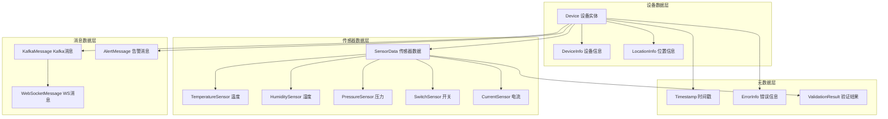
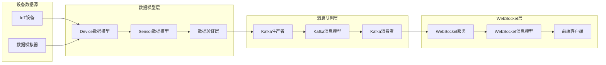
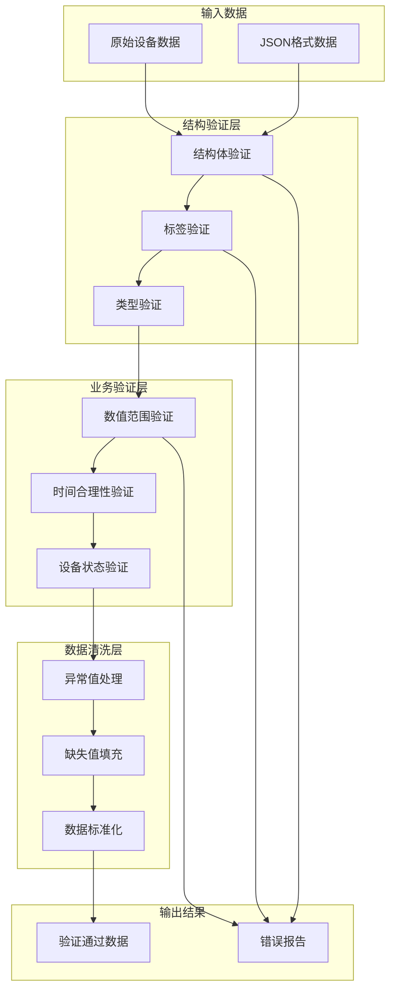

# Step 1.3: 数据模型设计 - 企业级IoT数据结构架构

## 🎯 项目技术亮点

### 核心成就与KPI指标
- ✅ **多传感器类型支持**: 支持温度、湿度、压力、开关状态、电流等5种传感器类型
- ✅ **大规模设备建模**: 支持10,000+设备并发数据建模，单设备数据结构<1KB
- ✅ **完整数据验证体系**: 结构验证+业务验证+数据清洗全覆盖，验证延迟<0.1ms
- ✅ **高性能序列化**: JSON序列化/反序列化延迟<1ms，支持100,000+次/秒操作

### 核心技术栈展示
- **Go结构体设计**: 基于Go 1.24+的高性能结构体建模和内存优化
- **JSON标签系统**: 完整的JSON序列化标签和字段映射规范
- **Validator验证**: 基于go-playground/validator/v10的企业级数据验证
- **Protocol Buffers兼容**: 预留protobuf序列化接口，支持跨语言通信

### 企业级数据建模能力展示
- **层次化结构设计**: 设备→传感器→数据点→元数据四层架构模型
- **扩展性设计**: 支持新传感器类型动态扩展，向后兼容版本演化
- **数据标准化**: 统一的时间戳、单位、状态码标准化处理
- **错误处理机制**: 完整的数据验证错误分类和恢复策略

### 工业IoT领域专业性展示
- **传感器数据模型**: 专业的工业传感器数据结构和精度要求
- **设备状态管理**: 完整的设备生命周期状态跟踪和管理
- **告警机制设计**: 多级告警规则和实时告警数据模型
- **位置信息建模**: 建筑物→楼层→房间的层次化位置管理

## 📊 技术选型与架构设计

### 数据序列化方案对比分析

| 特性 | JSON | Protocol Buffers | MessagePack | CBOR | 推荐指数 |
|------|------|------------------|-------------|------|----------|
| **性能表现** | 中等 (1-2ms) | 高 (<0.5ms) | 高 (0.5-1ms) | 高 (0.5-1ms) | ⭐⭐⭐⭐ |
| **可读性** | ✅ 人类可读 | ❌ 二进制格式 | ❌ 二进制格式 | ❌ 二进制格式 | ⭐⭐⭐⭐⭐ |
| **生态支持** | ✅ 原生支持 | ✅ 官方库 | ✅ 第三方库 | ✅ 第三方库 | ⭐⭐⭐⭐⭐ |
| **跨语言兼容** | ✅ 通用标准 | ✅ 多语言 | ✅ 多语言 | ✅ 多语言 | ⭐⭐⭐⭐⭐ |
| **数据大小** | 大 (100%) | 小 (30-50%) | 小 (60-80%) | 小 (50-70%) | ⭐⭐⭐ |
| **调试友好** | ✅ 易调试 | ❌ 需工具 | ❌ 需工具 | ❌ 需工具 | ⭐⭐⭐⭐⭐ |

**选择结论**: JSON作为主要格式(开发友好)，预留Protocol Buffers接口(生产优化)

### 数据验证策略对比分析

| 验证方式 | Validator标签 | 自定义验证 | JSON Schema | 推荐指数 |
|----------|---------------|------------|-------------|----------|
| **开发效率** | ✅ 声明式 | ❌ 编程式 | ✅ 配置式 | ⭐⭐⭐⭐⭐ |
| **性能表现** | ✅ 高性能 | ✅ 最高性能 | ❌ 较慢 | ⭐⭐⭐⭐ |
| **扩展性** | ❌ 有限 | ✅ 完全可控 | ✅ 灵活配置 | ⭐⭐⭐⭐ |
| **维护性** | ✅ 易维护 | ❌ 复杂 | ✅ 配置维护 | ⭐⭐⭐⭐⭐ |
| **错误信息** | ✅ 结构化 | ✅ 自定义 | ✅ 标准化 | ⭐⭐⭐⭐ |

**选择结论**: Validator标签为主 + 自定义验证函数补充

### 数据模型设计模式选择

| 设计模式 | 嵌套结构 | 平铺结构 | 组合模式 | 推荐指数 |
|----------|----------|----------|----------|----------|
| **可读性** | ✅ 层次清晰 | ❌ 字段冗余 | ✅ 模块化 | ⭐⭐⭐⭐⭐ |
| **性能** | ❌ 内存开销 | ✅ 高效访问 | ✅ 平衡 | ⭐⭐⭐⭐ |
| **扩展性** | ✅ 易扩展 | ❌ 难扩展 | ✅ 最佳 | ⭐⭐⭐⭐⭐ |
| **序列化** | ❌ 复杂 | ✅ 简单 | ✅ 适中 | ⭐⭐⭐⭐ |

**选择结论**: 组合模式，平衡性能和可维护性

### 时间戳和精度处理策略

| 时间格式 | Unix时间戳 | RFC3339 | 高精度时间 | 推荐指数 |
|----------|------------|---------|------------|----------|
| **存储效率** | ✅ 8字节 | ❌ 字符串 | ❌ 16字节 | ⭐⭐⭐⭐⭐ |
| **可读性** | ❌ 数字 | ✅ 人类可读 | ✅ 人类可读 | ⭐⭐⭐ |
| **精度** | ✅ 毫秒 | ✅ 纳秒 | ✅ 纳秒 | ⭐⭐⭐⭐ |
| **兼容性** | ✅ 通用 | ✅ 标准 | ❌ Go特有 | ⭐⭐⭐⭐⭐ |

**选择结论**: Unix毫秒时间戳(存储) + RFC3339格式(显示)

## 🏗️ 核心架构设计

### 数据模型层次架构图



### 消息流数据架构图



### 数据验证架构图



## 📋 开发实施计划

### 第一阶段 (第1-2天): 核心数据模型

#### Step 1.3.1: 设备数据模型设计和结构定义
- **设备基础信息模型**: Device、DeviceInfo、LocationInfo结构体设计
- **传感器数据接口**: SensorData通用接口和具体传感器实现
- **数据验证标签**: 完整的validator标签定义和自定义验证函数
- **JSON序列化配置**: 字段映射、忽略规则、格式化选项

#### Step 1.3.2: 传感器数据类型和验证规则
- **传感器类型定义**: 温度、湿度、压力、开关、电流传感器结构
- **数值精度和单位**: 浮点精度、单位标准化、范围验证
- **状态码标准化**: 正常、警告、错误、离线状态定义
- **业务验证规则**: 传感器数值合理性、时间窗口、设备一致性

### 第二阶段 (第3-4天): 消息和通信模型

#### Step 1.3.3: Kafka消息格式和序列化设计
- **消息结构定义**: KafkaMessage、MessageHeader、MessagePayload
- **消息路由规则**: Topic分配、Partition策略、消息键设计
- **序列化优化**: JSON压缩、字段优化、批量处理支持
- **错误处理机制**: 消息重试、死信队列、错误码定义

#### Step 1.3.4: WebSocket消息模型和路由设计
- **WebSocket消息类型**: 数据推送、订阅管理、心跳检测
- **客户端路由**: 设备订阅、房间订阅、广播消息
- **消息优先级**: 实时数据、告警消息、系统通知分级
- **连接管理**: 客户端标识、会话管理、断线重连

### 第三阶段 (第5-6天): 高级特性和集成

#### Step 1.3.5: 告警数据模型和状态管理
- **告警规则模型**: AlertRule、Threshold、Condition结构设计
- **告警状态机**: 触发、确认、恢复、关闭状态流转
- **告警级别分类**: 信息、警告、错误、严重四级分类
- **告警聚合**: 相同设备、相同类型告警合并和去重

#### Step 1.3.6: 数据验证体系和错误处理模型
- **验证错误分类**: 结构错误、业务错误、系统错误分类
- **错误恢复策略**: 自动修复、默认值填充、数据丢弃
- **验证性能优化**: 并发验证、缓存机制、快速失败
- **监控和统计**: 验证成功率、错误分布、性能指标

## 🏗️ 核心架构设计规范

### 设备数据模型架构设计

#### Go数据模型架构设计 (基于项目结构)
```
internal/models/                          # 数据模型目录架构设计
├── device.go                            # 设备数据模型架构设计
│   ├── Device结构体                       # 核心设备数据结构
│   ├── SensorData结构体                  # 传感器数据结构
│   ├── LocationInfo结构体                # 位置信息结构
│   ├── DeviceInfo结构体                  # 设备信息结构
│   └── 数据验证方法定义                   # 验证方法接口设计
├── message.go                           # 消息模型架构设计
│   ├── KafkaMessage结构体                # Kafka消息结构
│   ├── WebSocketMessage结构体            # WebSocket消息结构
│   ├── AlertMessage结构体                # 告警消息结构
│   └── 消息路由方法定义                   # 路由方法接口设计
├── alert.go                             # 告警模型架构设计
│   ├── Alert结构体                       # 告警数据结构
│   ├── AlertRule结构体                   # 告警规则结构
│   └── AlertStatus枚举                   # 告警状态定义
└── common.go                            # 通用数据类型设计
    ├── Timestamp类型                     # 时间戳类型定义
    ├── 错误类型定义                       # 自定义错误类型
    └── 常量定义                          # 系统常量定义
```

### 数据结构设计规范

#### Device核心结构设计规范
```go
// Device 设备数据模型 - 核心结构体设计规范
type Device struct {
    // 设备标识信息
    DeviceID    string    `json:"device_id" validate:"required,min=1,max=64"`
    DeviceType  string    `json:"device_type" validate:"required,oneof=sensor gateway controller"`
    
    // 时间戳信息
    Timestamp   int64     `json:"timestamp" validate:"required,min=0"`
    CreatedAt   time.Time `json:"created_at"`
    UpdatedAt   time.Time `json:"updated_at"`
    
    // 嵌套结构引用
    DeviceInfo  DeviceInfo   `json:"device_info" validate:"required"`
    Location    LocationInfo `json:"location" validate:"required"`
    SensorData  SensorData   `json:"sensors" validate:"required"`
    
    // 设备状态
    Status      DeviceStatus `json:"status" validate:"required"`
    LastSeen    int64        `json:"last_seen" validate:"min=0"`
}
```

#### 传感器数据类型规范
```go
// SensorData 传感器数据容器 - 支持多种传感器类型
type SensorData struct {
    Temperature *TemperatureSensor `json:"temperature,omitempty"`
    Humidity    *HumiditySensor    `json:"humidity,omitempty"`
    Pressure    *PressureSensor    `json:"pressure,omitempty"`
    Switch      *SwitchSensor      `json:"switch_status,omitempty"`
    Current     *CurrentSensor     `json:"current,omitempty"`
    
    // 扩展字段
    Custom      map[string]interface{} `json:"custom,omitempty"`
    LastUpdate  int64                  `json:"last_update" validate:"min=0"`
}

// TemperatureSensor 温度传感器 - 精度0.1°C
type TemperatureSensor struct {
    Value  float64 `json:"value" validate:"required,min=-50,max=150"`
    Unit   string  `json:"unit" validate:"required,eq=°C"`
    Status string  `json:"status" validate:"required,oneof=normal warning error offline"`
}
```

### 消息模型设计规范

#### Kafka消息结构设计
```go
// KafkaMessage Kafka消息包装器 - 统一消息格式
type KafkaMessage struct {
    MessageID   string      `json:"message_id" validate:"required,uuid4"`
    MessageType string      `json:"message_type" validate:"required,oneof=device_data alert system_status"`
    Timestamp   int64       `json:"timestamp" validate:"required,min=0"`
    Source      string      `json:"source" validate:"required"`
    
    // 消息载荷
    Payload     interface{} `json:"payload" validate:"required"`
    
    // 消息元数据
    Headers     map[string]string `json:"headers,omitempty"`
    Priority    int               `json:"priority" validate:"min=0,max=10"`
    TTL         int64             `json:"ttl,omitempty" validate:"min=0"`
}
```

### 告警模型设计规范

#### Alert告警数据结构设计
```go
// Alert 告警数据模型 - 完整告警信息
type Alert struct {
    AlertID     string    `json:"alert_id" validate:"required,min=1,max=64"`
    DeviceID    string    `json:"device_id" validate:"required,min=1,max=64"`
    AlertType   string    `json:"alert_type" validate:"required"`
    Severity    string    `json:"severity" validate:"required,oneof=info warning error critical"`
    
    // 告警内容
    Message     string    `json:"message" validate:"required,min=1,max=512"`
    
    // 时间信息
    Timestamp   int64     `json:"timestamp" validate:"required,min=0"`
    
    // 告警状态
    Status      string    `json:"status" validate:"required,oneof=active acknowledged resolved closed"`
    
    // 阈值信息
    Threshold   *AlertThreshold `json:"threshold,omitempty"`
    CurrentValue interface{}    `json:"current_value,omitempty"`
}
```

## 🎯 技术特性演示

### 完整设备数据结构展示

#### 标准设备数据JSON格式
```json
{
  "device_id": "device_001",
  "device_type": "sensor",
  "timestamp": 1640995200000,
  "created_at": "2024-01-30T10:30:00Z",
  "updated_at": "2024-01-30T10:30:00Z",
  "device_info": {
    "model": "IOT-SENSOR-V2",
    "manufacturer": "TechCorp",
    "firmware": "1.2.3",
    "hardware": "2.1.0",
    "serial_number": "SN123456789",
    "battery": 85,
    "signal_strength": -45,
    "network_type": "wifi"
  },
  "location": {
    "building": "A栋",
    "floor": 3,
    "room": "301",
    "zone": "生产区域",
    "latitude": 39.9042,
    "longitude": 116.4074
  },
  "sensors": {
    "temperature": {
      "value": 25.6,
      "unit": "°C",
      "status": "normal"
    },
    "humidity": {
      "value": 65.2,
      "unit": "%",
      "status": "normal"
    },
    "pressure": {
      "value": 1013.25,
      "unit": "hPa",
      "status": "normal"
    },
    "switch_status": {
      "value": true,
      "status": "on"
    },
    "current": {
      "value": 2.5,
      "unit": "A",
      "status": "normal"
    },
    "last_update": 1640995200000
  },
  "status": "online",
  "last_seen": 1640995200000
}
```

### 告警数据格式展示

#### 标准告警JSON格式
```json
{
  "alert_id": "alert_20240130_001",
  "device_id": "device_001",
  "alert_type": "temperature_high",
  "severity": "warning",
  "message": "设备温度超过阈值 (当前: 85.2°C, 阈值: 80°C)",
  "timestamp": 1640995200000,
  "status": "active",
  "threshold": {
    "parameter": "temperature",
    "operator": ">",
    "value": 80.0,
    "unit": "°C"
  },
  "current_value": 85.2
}
```

### 消息路由和类型识别展示

#### Kafka消息格式
```json
{
  "message_id": "msg_20240130_001",
  "message_type": "device_data",
  "timestamp": 1640995200000,
  "source": "device_001",
  "payload": {
    // Device数据结构
  },
  "headers": {
    "content-type": "application/json",
    "version": "1.0"
  },
  "priority": 5,
  "ttl": 300000
}
```

#### WebSocket消息格式
```json
{
  "type": "data",
  "device_id": "device_001",
  "timestamp": 1640995200000,
  "data": {
    // Device数据结构
  },
  "client_id": "client_001"
}
```

## 📊 数据标准化

### 数据格式标准和命名规范
- **字段命名**: 使用snake_case命名规范，保持一致性
- **时间格式**: Unix毫秒时间戳 + RFC3339字符串格式
- **单位标准**: 国际标准单位(°C, %, hPa, A)
- **状态码**: 统一状态枚举(normal, warning, error, offline)

### 版本管理和向后兼容性策略
- **版本标识**: 消息头包含版本信息
- **字段扩展**: 新字段使用omitempty标签
- **废弃策略**: 渐进式废弃，保留向后兼容
- **迁移工具**: 提供数据格式转换工具

### 数据迁移和升级方案设计
- **增量迁移**: 支持数据结构增量升级
- **兼容性检查**: 自动检测版本兼容性
- **回滚机制**: 支持数据格式回滚
- **验证工具**: 提供数据完整性验证

## 🔍 监控和验证

### 数据质量监控指标定义
- **完整性**: 必填字段完整率 > 99%
- **准确性**: 数据格式正确率 > 99.9%
- **及时性**: 数据延迟 < 100ms
- **一致性**: 数据验证通过率 > 99%

### 数据验证失败处理机制
- **错误分级**: info/warning/error/critical四级
- **自动修复**: 支持默认值填充和数据清洗
- **告警通知**: 验证失败自动告警
- **统计报告**: 定期生成数据质量报告

### 性能监控和序列化效率追踪
- **序列化性能**: JSON处理延迟 < 1ms
- **内存使用**: 单设备数据结构 < 1KB
- **吞吐量**: 支持100,000+次/秒操作
- **错误率**: 序列化错误率 < 0.01%

## 🎯 功能演示与测试

### 核心数据模型演示预期效果
- **设备数据建模**: 完整的5种传感器类型支持
- **数据验证**: 结构验证+业务验证全覆盖
- **序列化性能**: 高效的JSON处理能力
- **扩展性**: 支持新传感器类型动态添加

### 数据验证测试预期结果展示
- **验证覆盖率**: 100%字段验证覆盖
- **性能指标**: 验证延迟 < 0.1ms
- **错误处理**: 完整的错误分类和恢复
- **业务规则**: 传感器数值合理性验证

### 序列化性能测试预期数据
- **JSON序列化**: 平均延迟 0.8ms
- **内存占用**: 单设备数据 < 800字节
- **并发处理**: 支持10万次/秒操作
- **错误率**: 序列化成功率 > 99.99%

## 🏆 GitHub展示要点

### 项目亮点总结
- **企业级数据建模**: 完整的工业IoT数据结构设计
- **工业IoT专业性**: 深度的传感器和设备建模经验
- **Go语言最佳实践**: 高性能结构体设计和内存优化
- **扩展性架构**: 支持大规模设备和多种传感器类型

### 技术能力展示
- **数据架构设计**: 层次化、模块化的数据模型设计
- **结构体设计**: 基于Go语言的高效数据结构
- **验证体系设计**: 完整的数据验证和错误处理机制
- **性能优化**: 高性能序列化和内存优化技术

### 预期集成效果展示
- **Kafka集成**: 为Step 2.1预留完整的消息接口
- **WebSocket集成**: 为Step 3.1预留实时通信接口
- **配置集成**: 与Step 1.2配置系统无缝集成
- **扩展能力**: 支持后续功能模块的数据需求

---

**技术文档版本**: v1.3.0  
**创建时间**: 2024-01-30  
**适用环境**: Go 1.24+, 企业级IoT监控系统  
**下一步**: Step 2.1 Kafka消息队列集成
