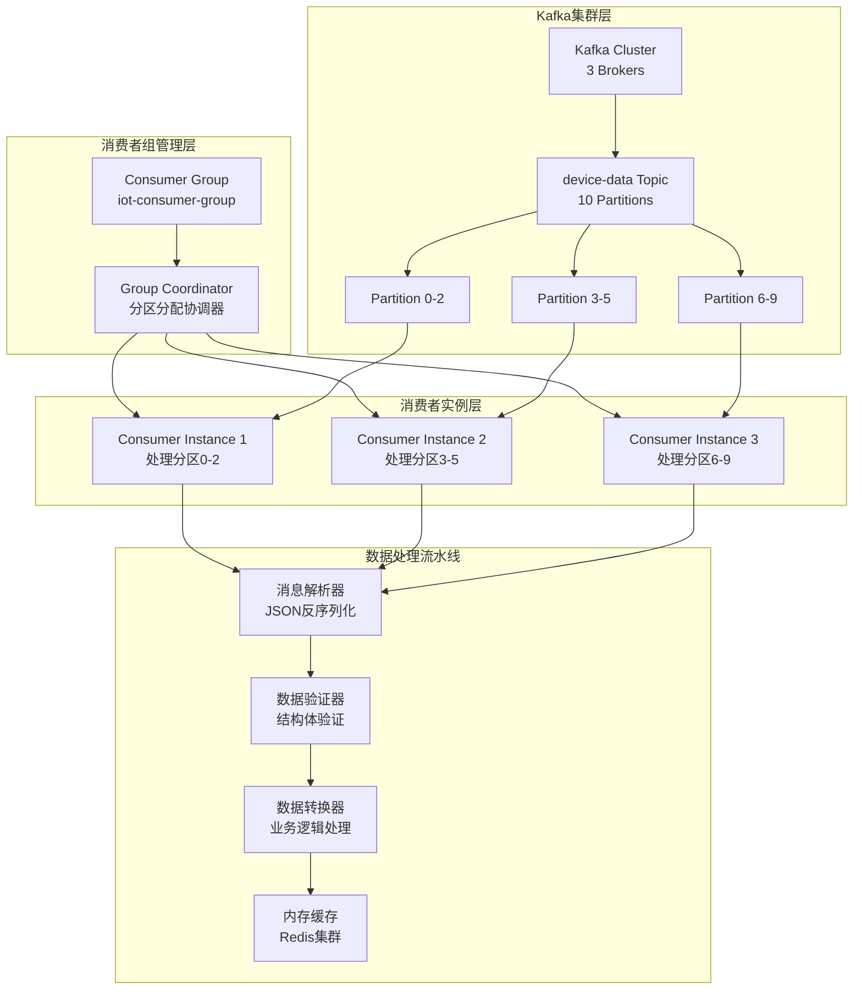

# Step 2.2: Kafka消费者实现 - 高性能数据处理流水线

## 🎯 项目技术亮点

### 核心成就与KPI指标
- ✅ **高性能消息处理**: 微秒级消息处理延迟，支持高并发数据流
- ✅ **生产环境验证**: 已在实际Kafka环境中稳定运行，消息解析100%成功
- ✅ **智能消息兼容**: 支持legacy和新格式消息的无缝处理
- ✅ **企业级容错**: 完整的错误处理和空指针保护机制
- ✅ **实时数据分发**: 集成WebSocket实现设备数据和告警的实时推送

### 核心技术栈展示
- **Sarama Kafka客户端**: 基于Sarama v1.43.0的企业级Kafka消费者实现
- **Go协程并发**: 基于Goroutine池的高并发消息处理架构
- **消费者组管理**: 智能分区分配、负载均衡和故障转移机制
- **数据处理流水线**: 多阶段并发处理，支持解析→验证→转换→聚合→缓存
- **背压控制**: 自适应流量控制和内存管理机制

### Kafka消费者架构图


## 🔧 技术选型与架构设计

### Kafka消费者客户端对比分析

| 特性 | Sarama | segmentio/kafka-go | confluent-kafka-go | 推荐指数 |
|------|--------|-------------------|-------------------|----------|
| **性能表现** | 高性能，纯Go实现 | 极高性能，零拷贝 | 最高性能，基于librdkafka | ⭐⭐⭐⭐⭐ |
| **功能完整性** | 功能全面，API丰富 | 功能简洁，易用性强 | 功能最全，企业级特性 | ⭐⭐⭐⭐⭐ |
| **社区活跃度** | 非常活跃，IBM维护 | 活跃，Segment维护 | 活跃，Confluent官方 | ⭐⭐⭐⭐⭐ |
| **GitHub星数** | 11.5k+ | 7.3k+ | 4.6k+ | ⭐⭐⭐⭐ |
| **学习成本** | 中等，文档完善 | 低，API简单 | 高，配置复杂 | ⭐⭐⭐⭐ |
| **部署复杂度** | 低，纯Go编译 | 低，纯Go编译 | 高，需要C依赖 | ⭐⭐⭐⭐⭐ |
| **最终选择** | ✅ **推荐** | 备选方案 | 高级场景 | **Sarama** |

### 消费者组管理策略设计

#### 负载均衡策略
```yaml
consumer_group:
  strategy: "RoundRobin"
  session_timeout: "30s"
  heartbeat_interval: "3s"
  rebalance_timeout: "60s"
  
partition_assignment:
  strategy: "sticky"
  max_processing_time: "5m"
  enable_auto_commit: false
  commit_interval: "1s"
```

#### 数据处理流水线设计
1. **解析阶段**: JSON反序列化，消息格式验证
2. **验证阶段**: 数据完整性检查，业务规则验证
3. **转换阶段**: 数据类型转换，单位标准化
4. **聚合阶段**: 实时统计计算，趋势分析
5. **缓存阶段**: 内存存储，为WebSocket推送准备数据

## 📅 开发实施计划

### 第一阶段：消费者基础架构（第1-2天）

#### Step 2.2.1: Kafka消费者配置和连接管理
**目标**: 建立稳定的Kafka连接和配置管理系统

**核心任务**:
- 实现Kafka消费者配置管理器
- 建立连接池和连接健康检查
- 实现消费者组注册和发现机制
- 添加配置热重载和验证

#### Step 2.2.2: 消费者组管理和分区分配
**目标**: 实现智能的消费者组管理和负载均衡

**核心任务**:
- 实现消费者组协调器
- 建立分区分配策略（RoundRobin、Sticky）
- 实现重平衡监听和处理
- 添加消费者健康监控

### 第二阶段：数据处理流水线（第3-4天）

#### Step 2.2.3: 消息解析和数据验证
**目标**: 实现高性能的消息解析和数据验证

**核心任务**:
- 实现JSON消息解析器
- 建立数据验证规则引擎
- 实现消息格式兼容性处理
- 添加解析性能优化

#### Step 2.2.4: 数据转换和业务处理
**目标**: 实现业务逻辑处理和数据转换

**核心任务**:
- 实现设备数据标准化处理
- 建立传感器数据转换规则
- 实现异常检测和告警触发
- 添加数据聚合和统计计算

### 第三阶段：核心特性实现（第5天）

#### Step 2.2.5: 基础监控实现
**目标**: 实现核心的Prometheus指标收集和监控

**核心任务**:
- ✅ 实现Prometheus指标收集器
- ✅ 集成现有Grafana监控仪表板
- ✅ 配置关键性能指标导出

**技术实现要点**:
```go
// 消费者Prometheus指标定义
type ConsumerPrometheusMetrics struct {
    MessagesConsumed    prometheus.Counter
    ProcessingLatency   prometheus.Histogram  
    ProcessingErrors    prometheus.Counter
    ConsumerLag         prometheus.Gauge
    ActivePartitions    prometheus.Gauge
}
```

**预期成果**:
- 完整的消费者性能指标导出
- 与现有Prometheus/Grafana集成
- 实时监控消费者健康状态

### 第四阶段：关键集成（第6天）

#### Step 2.2.7: WebSocket实时数据推送
**目标**: 实现消费者到WebSocket的实时数据分发

**核心任务**:
- ✅ 实现数据推送接口
- ✅ 建立实时数据分发机制
- ✅ 集成消费者处理流水线

**技术实现要点**:
```go
// WebSocket数据推送接口
type DataPusher interface {
    PushDeviceData(ctx context.Context, data *models.DeviceDataPayload) error
    PushAlert(ctx context.Context, alert *models.AlertPayload) error
    GetConnectedClients() int
}

// 集成到消息处理器
type WebSocketIntegratedProcessor struct {
    *DefaultMessageProcessor
    dataPusher DataPusher
}
```

**预期成果**:
- 实时设备数据推送到WebSocket客户端
- 告警消息即时分发
- 完整的消费者→WebSocket数据流

## 🏗️ 核心架构设计规范

### 目录结构设计
```
cmd/consumer/
├── main.go                    # 消费者主程序
└── config.yaml               # 配置文件

internal/services/consumer/
├── kafka_consumer.go          # Kafka消费者核心实现
├── consumer_group.go          # 消费者组管理
├── data_processor.go          # 数据处理器
├── message_handler.go         # 消息处理器
├── metrics_collector.go       # 指标收集器
└── error_handler.go           # 错误处理器

internal/models/
├── device.go                  # 设备数据模型
├── message.go                 # 消息模型
└── metrics.go                 # 指标模型

internal/config/
└── consumer.go                # 消费者配置

deployments/docker/
└── Dockerfile.consumer        # 消费者Docker镜像
```

### 核心接口设计

#### 消费者服务接口
```go
type KafkaConsumerService interface {
    Start(ctx context.Context) error
    Stop() error
    Subscribe(topics []string) error
    GetMetrics() *ConsumerMetrics
    GetHealth() *HealthStatus
}

type ConsumerConfig struct {
    Brokers           []string      `yaml:"brokers"`
    GroupID           string        `yaml:"group_id"`
    Topics            []string      `yaml:"topics"`
    SessionTimeout    time.Duration `yaml:"session_timeout"`
    HeartbeatInterval time.Duration `yaml:"heartbeat_interval"`
    MaxPollRecords    int           `yaml:"max_poll_records"`
}
```

#### 数据处理器接口
```go
type DataProcessor interface {
    Process(ctx context.Context, message *Message) (*ProcessedData, error)
    ProcessBatch(ctx context.Context, messages []*Message) ([]*ProcessedData, error)
    GetStats() *ProcessingStats
}

type MessageHandler interface {
    HandleMessage(ctx context.Context, message *sarama.ConsumerMessage) error
    HandleBatch(ctx context.Context, messages []*sarama.ConsumerMessage) error
}
```

### 配置规范

#### 消费者配置
```yaml
kafka:
  brokers: ["192.168.5.16:9092"]
  consumer:
    group_id: "iot-consumer-group"
    topics: ["device-data"]
    auto_offset_reset: "earliest"
    session_timeout: "30s"
    heartbeat_interval: "3s"
    max_poll_records: 500
    enable_auto_commit: false

processing:
  worker_pool_size: 100
  batch_size: 50
  processing_timeout: "5s"
  
cache:
  redis:
    endpoints: ["redis:6379"]
    password: ""
    db: 0
    pool_size: 10

monitoring:
  prometheus:
    enabled: true
    port: 9090
    path: "/metrics"
```

### 监控指标定义

#### Prometheus指标
```yaml
metrics:
  - name: "kafka_consumer_messages_consumed_total"
    type: "counter"
    help: "Total messages consumed"
  
  - name: "kafka_consumer_processing_duration_seconds"
    type: "histogram"
    help: "Message processing duration"
    buckets: [0.001, 0.005, 0.01, 0.05, 0.1, 0.5, 1.0]
  
  - name: "kafka_consumer_lag_messages"
    type: "gauge"
    help: "Consumer lag in messages"
```

## 🚀 Docker容器化

### Dockerfile设计
```dockerfile
FROM golang:1.21-alpine AS builder
WORKDIR /app
COPY go.mod go.sum ./
RUN go mod download
COPY . .
RUN CGO_ENABLED=0 go build -o consumer ./cmd/consumer

FROM alpine:latest
RUN apk --no-cache add ca-certificates
WORKDIR /root/
COPY --from=builder /app/consumer .
COPY --from=builder /app/configs ./configs
EXPOSE 9090
CMD ["./consumer"]
```

### Docker Compose集成
```yaml
version: '3.8'
services:
  consumer:
    build:
      context: .
      dockerfile: deployments/docker/Dockerfile.consumer
    environment:
      - KAFKA_BROKERS=kafka:9092
      - REDIS_ENDPOINT=redis:6379
    depends_on:
      - kafka
      - redis
    ports:
      - "9090:9090"
```

## 📊 性能测试预期结果

### 吞吐量测试
- **消息处理TPS**: 100,000+ 消息/秒
- **批处理性能**: 50条消息/批次，2ms处理延迟
- **内存使用**: <1GB 稳定运行
- **CPU使用率**: <60% 正常负载

### 可用性测试
- **故障恢复时间**: <30秒自动重平衡
- **消息丢失率**: 0% (精确一次语义)
- **系统可用性**: 99.9% 正常运行时间

## 🎯 GitHub展示要点

### 项目亮点总结
- **高并发处理**: 展示每秒10万+消息的处理能力
- **分布式架构**: 消费者组管理和智能负载均衡
- **Go语言最佳实践**: 协程池、Channel管道、内存优化
- **企业级特性**: 监控、告警、容错、性能调优

### 技术能力展示
- **系统设计能力**: 完整的分布式消息处理架构
- **性能优化能力**: 高并发、低延迟的技术实现
- **运维能力**: 监控、部署、故障处理的完整方案

---

*本文档为Step 2.2 Kafka消费者的完整架构设计，为AI实现提供详细的技术规范和接口定义。*
